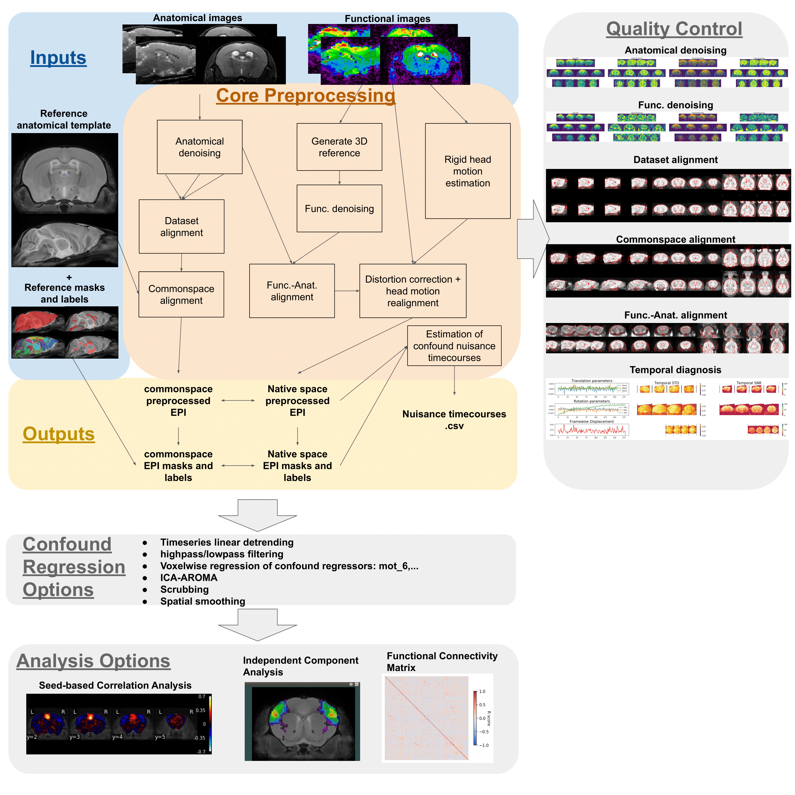
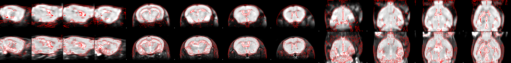

# RABIES: Rodent Automated Bold Improvement of EPI Sequences.



# Installation

The software is available on PyPi https://pypi.org/project/rabies/.
You can install it on your local python environment with ```pip install rabies```.

For general uses, we recommend instead using a containerized installation with Singularity (https://singularity.lbl.gov) or Docker (https://www.docker.com),
which will contain all additional dependencies from *dependencies.txt* and ensure reproducible behavior.
See https://hub.docker.com/repository/docker/gabdesgreg/rabies/general for available versions.

* Install Singularity .sif image ```singularity build rabies.sif docker://gabdesgreg/rabies:tagname```
* Install Docker image: ```docker pull gabdesgreg/rabies:tagname```

# Command Line Interface (CLI)

The following section describes the --help outputs from the command line interface

## General CLI
<details><summary><b>Click to expand</b></summary>
<p>

```
usage: rabies [-h] [-p {Linear,MultiProc,SGE,SGEGraph,PBS,LSF,SLURM,SLURMGraph}] [--local_threads LOCAL_THREADS] [--scale_min_memory SCALE_MIN_MEMORY] [--min_proc MIN_PROC]
              [--verbose VERBOSE]
              Processing stage ...

RABIES performs multiple stages of rodent fMRI image processing, including preprocessing, 
confound correction, simple analyses and data quality assessment.

optional arguments:
  -h, --help            show this help message and exit

Processing options:
  The RABIES workflow is seperated into three main processing stages: preprocessing, 
  confound correction and analysis. Outputs from the preprocessing provide the inputs for
  the subsequent confound correction, and finally analysis.

  Processing stage      Description
    preprocess          
                        Conducts preprocessing on an input dataset in BIDS format. Preprocessing includes 
                        motion realignment, susceptibility distortions correction through non-linear 
                        registration, alignment to commonspace, anatomical parcellation and evaluation of 
                        nuisance timecourses.
                        
    confound_correction
                        
                        Flexible options for confound correction are applied directly on preprocessing outputs
                        from RABIES to derive cleaned timeseries. Various correction strategies, if selected, are
                        applied in the following order, following best practices from human litterature:
                           #1 - Compute and apply frame censoring mask (from FD and/or DVARS thresholds)
                           #2 - Linear detrending of fMRI timeseries and nuisance regressors
                           #3 - Apply ICA-AROMA.
                           #4 - If frequency filtering and frame censoring are applied, simulate data in censored
                               timepoints using the Lomb-Scargle periodogram, as suggested in Power et al. (2014, 
                               Neuroimage), for both the fMRI timeseries and nuisance regressors prior to filtering.
                           #5 - As recommended in Lindquist et al. (2019, Human brain mapping), make the nuisance 
                               regressors orthogonal to the temporal frequency filter.
                           #6 - Apply highpass and/or lowpass filtering on the fMRI timeseries (with simulated 
                               timepoints).
                           #7 - Re-apply the frame censoring mask onto filtered fMRI timeseries and nuisance 
                               regressors, taking out the simulated timepoints. Edge artefacts from frequency 
                               filtering can also be removed as recommended in Power et al. (2014, Neuroimage).
                           #8 - Apply confound regression using the selected nuisance regressors (see --conf_list
                               options).
                           #9 - Standardize timeseries
                           #10 - Apply Gaussian spatial smoothing.
                        
    analysis            
                        Conduct simple resting-state functional connectivity (FC) analysis, or data quality
                        diagnosis, on cleaned timeseries after confound correction. Analysis options include
                        seed-based FC, whole-brain FC matrix, group-ICA and dual regression. --data_diagnosis
                        computes features of data quality at the individual scan and group levels, as in 
                        Desrosiers-Gregoire et al. (in prep)
                        

Execution Options:
  Options for parallel execution and memory management.

  -p {Linear,MultiProc,SGE,SGEGraph,PBS,LSF,SLURM,SLURMGraph}, --plugin {Linear,MultiProc,SGE,SGEGraph,PBS,LSF,SLURM,SLURMGraph}
                        Specify the nipype plugin for workflow execution.
                        Consult https://nipype.readthedocs.io/en/0.11.0/users/plugins.html for details.
                        (default: Linear)
                        
  --local_threads LOCAL_THREADS
                        For --plugin MultiProc, set the maximum number of processors run in parallel.
                        Defaults to number of CPUs.
                        (default: 12)
                        
  --scale_min_memory SCALE_MIN_MEMORY
                        For --plugin MultiProc, set the memory scaling factor attributed to nodes during
                        execution. Increase the scaling if memory crashes are reported.
                        (default: 1.0)
                        
  --min_proc MIN_PROC   For --plugin SGE/SGEGraph, scale the number of nodes attributed to jobs to
                        avoid memory crashes.
                        (default: 1)
                        
  --verbose VERBOSE     Set the verbose level. 0=WARNING, 1=INFO, 2 or above=DEBUG.
                        (default: 1)
```
</p>
</details>

## Preprocessing CLI
<details><summary><b>Click to expand</b></summary>
<p>

```
usage: rabies preprocess [-h] [--bold_only] [--anat_autobox] [--bold_autobox] [--apply_despiking] [--HMC_option {intraSubjectBOLD,0,1,2,3}] [--apply_slice_mc] [--detect_dummy]
                         [--data_type {int16,int32,float32,float64}] [--anat_inho_cor_method {Rigid,Affine,SyN,no_reg,N4_reg,disable}]
                         [--bold_inho_cor_method {Rigid,Affine,SyN,no_reg,N4_reg,disable}] [--bold_inho_cor_otsu BOLD_INHO_COR_OTSU] [--atlas_reg_script {Rigid,Affine,SyN,no_reg}]
                         [--coreg_script {Rigid,Affine,SyN,no_reg}] [--commonspace_masking] [--coreg_masking] [--brain_extraction] [--fast_commonspace]
                         [--nativespace_resampling NATIVESPACE_RESAMPLING] [--commonspace_resampling COMMONSPACE_RESAMPLING] [--anatomical_resampling ANATOMICAL_RESAMPLING] [--apply_STC]
                         [--TR TR] [--tpattern {alt,seq}] [--anat_template ANAT_TEMPLATE] [--brain_mask BRAIN_MASK] [--WM_mask WM_MASK] [--CSF_mask CSF_MASK]
                         [--vascular_mask VASCULAR_MASK] [--labels LABELS]
                         bids_dir output_dir

positional arguments:
  bids_dir              The root folder of the BIDS-formated input data directory.
                        
  output_dir            the output path to drop outputs from major preprocessing steps.
                        

optional arguments:
  -h, --help            show this help message and exit
  --bold_only           Apply preprocessing with only EPI scans. Commonspace registration is executed directly using
                        the corrected EPI 3D reference images. The commonspace registration simultaneously applies
                        distortion correction, this option will produce only commonspace outputs.
                        (default: False)
                        
  --anat_autobox        Crops out extra space around the brain on the structural image using AFNI's 3dAutobox
                        https://afni.nimh.nih.gov/pub/dist/doc/program_help/3dAutobox.html.
                        (default: False)
                        
  --bold_autobox        Crops out extra space around the brain on the EPI image using AFNI's 3dAutobox
                        https://afni.nimh.nih.gov/pub/dist/doc/program_help/3dAutobox.html.
                        (default: False)
                        
  --apply_despiking     Applies AFNI's 3dDespike https://afni.nimh.nih.gov/pub/dist/doc/program_help/3dDespike.html.
                        (default: False)
                        
  --HMC_option {intraSubjectBOLD,0,1,2,3}
                        Select an option for head motion realignment among the pre-built options from
                        https://github.com/ANTsX/ANTsR/blob/master/R/ants_motion_estimation.R.
                        (default: intraSubjectBOLD)
                        
  --apply_slice_mc      Whether to apply a slice-specific motion correction after initial volumetric HMC. This can 
                        correct for interslice misalignment resulting from within-TR motion. With this option, 
                        motion corrections and the subsequent resampling from registration are applied sequentially
                        since the 2D slice registrations cannot be concatenate with 3D transforms. 
                        (default: False)
                        
  --detect_dummy        Detect and remove initial dummy volumes from the EPI, and generate a reference EPI based on
                        these volumes if detected. Dummy volumes will be removed from the output preprocessed EPI.
                        (default: False)
                        
  --data_type {int16,int32,float32,float64}
                        Specify data format outputs to control for file size.
                        (default: float32)
                        

Registration Options:
  Customize registration operations and troubleshoot registration failures.
  *** Rigid: conducts only rigid registration.
  *** Affine: conducts Rigid then Affine registration.
  *** SyN: conducts Rigid, Affine then non-linear registration.
  *** no_reg: skip registration.

  --anat_inho_cor_method {Rigid,Affine,SyN,no_reg,N4_reg,disable}
                        Select a registration type for masking during inhomogeneity correction of the structural 
                        image. 
                        *** N4_reg: previous correction script prior to version 0.3.1.
                        *** disable: disables the inhomogeneity correction.
                        (default: SyN)
                        
  --bold_inho_cor_method {Rigid,Affine,SyN,no_reg,N4_reg,disable}
                        Select a registration type for masking during inhomogeneity correction of the EPI.
                        *** N4_reg: previous correction script prior to version 0.3.1.
                        *** disable: disables the inhomogeneity correction.
                        (default: Rigid)
                        
  --bold_inho_cor_otsu BOLD_INHO_COR_OTSU
                        The inhomogeneity correction script necessitates an initial correction with a Otsu
                        masking strategy (prior to registration of an anatomical mask). This option sets the 
                        Otsu threshold level to capture the right intensity distribution.
                        (default: 2)
                        
  --atlas_reg_script {Rigid,Affine,SyN,no_reg}
                        Specify a registration script for alignment of the dataset-generated unbiased template 
                        to the commonspace atlas.
                        (default: SyN)
                        
  --coreg_script {Rigid,Affine,SyN,no_reg}
                        Specify the registration script for cross-modal alignment between the EPI and structural
                        images. This operation is responsible for correcting EPI susceptibility distortions.
                        (default: SyN)
                        
  --commonspace_masking
                        Combine masks derived from the inhomogeneity correction step to support registration 
                        during the generation of the unbiased template, and then during atlas registration. 
                        (default: False)
                        
  --coreg_masking       Use the mask from the EPI inhomogeneity correction step to support registration to the
                        structural image.
                        (default: False)
                        
  --brain_extraction    If using --commonspace_masking and/or --coreg_masking, this option will conduct brain
                        extractions prior to registration based on the initial mask during inhomogeneity
                        correction. This will enhance brain edge-matching, but requires good quality masks.
                        (default: False)
                        
  --fast_commonspace    Skip the generation of a dataset-generated unbiased template, and instead, register each
                        anatomical scan independently directly onto the commonspace atlas, using the
                        --atlas_reg_script registration. This option can be faster, but may decrease the quality
                        of alignment between subjects.(default: False)
                        

Resampling Options:
  The following options allow to resample the voxel dimensions for the preprocessed EPIs
  or for the anatomical images during registration.
  The resampling syntax must be 'dim1xdim2xdim3' (in mm), follwing the RAS axis convention
  (dim1=Right-Left, dim2=Anterior-Posterior, dim3=Superior-Inferior). If 'inputs_defined'
  is provided instead of axis dimensions, the original dimensions are preserved.

  --nativespace_resampling NATIVESPACE_RESAMPLING
                        Can specify a resampling dimension for the nativespace fMRI outputs.
                        (default: inputs_defined)
                        
  --commonspace_resampling COMMONSPACE_RESAMPLING
                        Can specify a resampling dimension for the commonspace fMRI outputs.
                        (default: inputs_defined)
                        
  --anatomical_resampling ANATOMICAL_RESAMPLING
                        
                        This specifies resampling dimensions for the anatomical registration targets. By 
                        default, images are resampled to isotropic resolution based on the smallest dimension
                        among the provided anatomical images (EPI images instead if --bold_only is True). 
                        Increasing voxel resampling size will increase registration speed at the cost of 
                        accuracy.
                        (default: inputs_defined)
                        

STC Options:
  Specify Slice Timing Correction (STC) info that is fed to AFNI's 3dTshift
  (https://afni.nimh.nih.gov/pub/dist/doc/program_help/3dTshift.html). The STC is applied
  in the anterior-posterior orientation, and thus RABIES assumes slices were acquired in
  this direction.

  --apply_STC           Select this option to apply the STC step.
                        (default: False)
                        
  --TR TR               Specify repetition time (TR) in seconds. (e.g. --TR 1.2)
                        (default: auto)
                        
  --tpattern {alt,seq}  Specify if interleaved ('alt') or sequential ('seq') acquisition.
                        (default: alt)
                        

Template Files:
  Specify commonspace template and associated mask/label files. By default, RABIES
  provides the mouse DSURQE atlas
  https://wiki.mouseimaging.ca/display/MICePub/Mouse+Brain+Atlases.

  --anat_template ANAT_TEMPLATE
                        Anatomical file for the commonspace atlas.
                        (default: /home/gabriel/.local/share/rabies/DSURQE_40micron_average.nii.gz)
                        
  --brain_mask BRAIN_MASK
                        Brain mask aligned with the template.
                        (default: /home/gabriel/.local/share/rabies/DSURQE_40micron_mask.nii.gz)
                        
  --WM_mask WM_MASK     White matter mask aligned with the template.
                        (default: /home/gabriel/.local/share/rabies/DSURQE_40micron_eroded_WM_mask.nii.gz)
                        
  --CSF_mask CSF_MASK   CSF mask aligned with the template.
                        (default: /home/gabriel/.local/share/rabies/DSURQE_40micron_eroded_CSF_mask.nii.gz)
                        
  --vascular_mask VASCULAR_MASK
                        Can provide a mask of major blood vessels to compute associated nuisance timeseries.
                        The default mask was generated by applying MELODIC ICA and selecting the resulting 
                        component mapping onto major brain vessels.
                        (default: /home/gabriel/.local/share/rabies/vascular_mask.nii.gz)
                        
  --labels LABELS       Labels file providing the atlas anatomical annotations.
                        (default: /home/gabriel/.local/share/rabies/DSURQE_40micron_labels.nii.gz)
```

</p>
</details>

## Confound Correction CLI
<details><summary><b>Click to expand</b></summary>
<p>

```
usage: rabies confound_correction [-h] [--read_datasink] [--nativespace_analysis] [--TR TR] [--highpass HIGHPASS] [--lowpass LOWPASS] [--edge_cutoff EDGE_CUTOFF]
                                  [--smoothing_filter SMOOTHING_FILTER] [--run_aroma] [--aroma_dim AROMA_DIM] [--aroma_random_seed AROMA_RANDOM_SEED]
                                  [--conf_list [{WM_signal,CSF_signal,vascular_signal,global_signal,aCompCor,mot_6,mot_24,mean_FD} ...]] [--FD_censoring]
                                  [--FD_threshold FD_THRESHOLD] [--DVARS_censoring] [--minimum_timepoint MINIMUM_TIMEPOINT] [--standardize]
                                  [--timeseries_interval TIMESERIES_INTERVAL]
                                  preprocess_out output_dir

positional arguments:
  preprocess_out        path to RABIES preprocessing output directory.
                        
  output_dir            path for confound correction output directory.
                        

optional arguments:
  -h, --help            show this help message and exit
  --read_datasink       
                        Choose this option to read preprocessing outputs from datasinks instead of the saved 
                        preprocessing workflow graph. This allows to run confound correction without having 
                        available RABIES preprocessing folders, but the targetted datasink folders must follow the
                        structure of RABIES preprocessing.
                        (default: False)
                        
  --nativespace_analysis
                        Conduct confound correction and analysis in native space.
                        (default: False)
                        
  --TR TR               Specify repetition time (TR) in seconds. (e.g. --TR 1.2)
                        (default: auto)
                        
  --highpass HIGHPASS   Specify highpass filter frequency.
                        (default: None)
                        
  --lowpass LOWPASS     Specify lowpass filter frequency.
                        (default: None)
                        
  --edge_cutoff EDGE_CUTOFF
                        Specify the number of seconds to cut at beginning and end of acquisition if applying a
                        frequency filter. Frequency filters generate edge effects at begining and end of the
                        timeseries. We recommend to cut those timepoints (around 30sec at both end for 0.01Hz 
                        highpass.).
                        (default: 0)
                        
  --smoothing_filter SMOOTHING_FILTER
                        Specify filter size in mm for spatial smoothing. Will apply nilearn's function 
                        https://nilearn.github.io/modules/generated/nilearn.image.smooth_img.html
                        (default: None)
                        
  --run_aroma           Whether to run ICA-AROMA or not. The original classifier (Pruim et al. 2015) was modified
                        to incorporate rodent-adapted masks and classification hyperparameters.
                        (default: False)
                        
  --aroma_dim AROMA_DIM
                        Specify a pre-determined number of MELODIC components to derive for ICA-AROMA.
                        (default: 0)
                        
  --aroma_random_seed AROMA_RANDOM_SEED
                        For reproducibility, this option sets a fixed random seed for MELODIC.
                        (default: 1)
                        
  --conf_list [{WM_signal,CSF_signal,vascular_signal,global_signal,aCompCor,mot_6,mot_24,mean_FD} ...]
                        Select list of nuisance regressors that will be applied on voxel timeseries, i.e., confound
                        regression.
                        *** WM/CSF/vascular/global_signal: correspond to mean signal from WM/CSF/vascular/brain 
                           masks.
                        *** mot_6: 6 rigid head motion correction parameters.
                        *** mot_24: mot_6 + their temporal derivative, then all 12 parameters squared, as in 
                           Friston et al. (1996, Magnetic Resonance in Medicine).
                        *** aCompCor: method from Muschelli et al. (2014, Neuroimage), where component timeseries
                           are obtained using PCA, conducted on the combined WM and CSF masks voxel timeseries. 
                           Components adding up to 50 percent of the variance are included.
                        *** mean_FD: the mean framewise displacement timecourse.
                        (default: [])
                        
  --FD_censoring        Apply frame censoring based on a framewise displacement threshold (i.e.scrubbing).
                        The frames that exceed the given threshold, together with 1 back and 2 forward frames
                        will be masked out, as in Power et al. (2012, Neuroimage).
                        (default: False)
                        
  --FD_threshold FD_THRESHOLD
                        --FD_censoring threshold in mm.
                        (default: 0.05)
                        
  --DVARS_censoring     Whether to remove timepoints that present outlier values on the DVARS metric (temporal
                        derivative of global signal). This method will censor timepoints until the distribution
                        of DVARS values across time does not contain outliers values above or below 2.5 standard
                        deviations.
                        (default: False)
                        
  --minimum_timepoint MINIMUM_TIMEPOINT
                        Can set a minimum number of timepoints remaining after frame censoring. If the threshold
                        is not met, an empty file is generated and the scan is not considered in further steps.
                        (default: 3)
                        
  --standardize         Whether to standardize timeseries (z-scoring).
                        (default: False)
                        
  --timeseries_interval TIMESERIES_INTERVAL
                        Before confound correction, can crop the timeseries within a specific interval.
                        e.g. '0,80' for timepoint 0 to 80.
                        (default: all)
```

</p>
</details>

## Analysis CLI
<details><summary><b>Click to expand</b></summary>
<p>

```
usage: rabies analysis [-h] [--scan_list [SCAN_LIST ...]] [--prior_maps PRIOR_MAPS] [--prior_bold_idx [PRIOR_BOLD_IDX ...]] [--prior_confound_idx [PRIOR_CONFOUND_IDX ...]]
                       [--data_diagnosis] [--seed_list [SEED_LIST ...]] [--seed_prior_list [SEED_PRIOR_LIST ...]] [--FC_matrix] [--ROI_type {parcellated,voxelwise}]
                       [--group_ICA] [--dim DIM] [--melodic_random_seed MELODIC_RANDOM_SEED] [--DR_ICA] [--dual_ICA DUAL_ICA]
                       confound_correction_out output_dir

positional arguments:
  confound_correction_out
                        path to RABIES confound correction output directory.
                        
  output_dir            path for analysis outputs.
                        

optional arguments:
  -h, --help            show this help message and exit
  --scan_list [SCAN_LIST ...]
                        This option offers to run the analysis on a subset of the scans. The scans are selected by
                        providing the full path to the corresponding EPI file in the input BIDS folder. The list 
                        of scan can be specified manually as a list of file name '--scan_list scan1.nii.gz 
                        scan2.nii.gz ...' or the files can be imbedded into a .txt file with one filename per row.
                        By default, 'all' will use all the scans previously processed.
                        (default: ['all'])
                        
  --prior_maps PRIOR_MAPS
                        Provide a 4D nifti image with a series of spatial priors representing common sources of
                        signal (e.g. ICA components from a group-ICA run). This 4D prior map file will be used for 
                        Dual regression, Dual ICA and --data_diagnosis. The RABIES default corresponds to a MELODIC 
                        run on a combined group of anesthetized-ventilated and awake mice. Confound correction 
                        consisted of highpass at 0.01 Hz, FD censoring at 0.03mm, DVARS censoring, and 
                        mot_6,WM_signal,CSF_signal as regressors.
                        (default: /home/gabriel/.local/share/rabies/melodic_IC.nii.gz)
                        
  --prior_bold_idx [PRIOR_BOLD_IDX ...]
                        Specify the indices for the priors corresponding to BOLD sources from --prior_maps. These will
                        be fitted during Dual ICA and provide the BOLD components during --data_diagnosis.
                        (default: [5, 12, 19])
                        
  --prior_confound_idx [PRIOR_CONFOUND_IDX ...]
                        Specify the indices for the confound components from --prior_maps. This is pertinent for the
                        --data_diagnosis outputs.
                        (default: [0, 1, 2, 6, 7, 8, 9, 10, 11, 13, 14, 21, 22, 24, 26, 28, 29])
                        
  --data_diagnosis      This option carries out the spatiotemporal diagnosis as described in Desrosiers-Gregoire et al. 
                        The diagnosis generates key temporal and spatial features both at the scan level and the group
                        level, allowing the identification of sources of confounds and data quality issues. We recommend 
                        using this data diagnosis workflow, more detailed in the publication, to improve the control for 
                        data quality issues and prevent the corruptions of analysis outputs.
                        (default: False)
                        
  --seed_list [SEED_LIST ...]
                        Can provide a list of Nifti files providing a mask for an anatomical seed, which will be used
                        to evaluate seed-based connectivity maps using on Pearson's r. Each seed must consist of 
                        a binary mask representing the ROI in commonspace.
                        (default: [])
                        
  --seed_prior_list [SEED_PRIOR_LIST ...]
                        For analysis QC of seed-based FC during --data_diagnosis, prior network maps are required for 
                        each seed provided in --seed_list. Provide the list of prior files in matching order of the 
                        --seed_list arguments to match corresponding seed maps.
                        (default: [])
                        
  --FC_matrix           Compute whole-brain connectivity matrices using Pearson's r between ROI timeseries.
                        (default: False)
                        
  --ROI_type {parcellated,voxelwise}
                        Define ROIs for --FC_matrix between 'parcellated' from the provided atlas during preprocessing,
                        or 'voxelwise' to derive the correlations between every voxel.(default: parcellated)
                        
  --DR_ICA              Conduct dual regression on each subject timeseries, using the priors from --prior_maps. The
                        linear coefficients from both the first and second regressions will be provided as outputs.
                        Requires that confound correction was conducted on commonspace outputs.
                        (default: False)
                        
  --dual_ICA DUAL_ICA   Option for performing a Dual ICA. Specify how many subject-specific sources to compute 
                        during dual ICA. Dual ICA will provide a fit for each --prior_bold_idx from --prior_maps.
                        (default: 0)
                        

Group ICA:
  Options for performing group-ICA using FSL's MELODIC on the whole dataset cleaned timeseries.
  Note that confound correction must have been conducted on commonspace outputs.

  --group_ICA           Perform group-ICA.
                        (default: False)
                        
  --dim DIM             Derive a fixed number of ICA components during group-ICA. The default uses an automatic 
                        estimation.
                        (default: 0)
                        
  --melodic_random_seed MELODIC_RANDOM_SEED
                        For reproducibility, can manually set a random seed for MELODIC. 
                        (default: 1)
```

</p>
</details>

# Step 1: Organize Input Data

Input folder must follow the BIDS structure (https://bids.neuroimaging.io/). RABIES will iterate through subjects and search for all available functional scans with suffix 'bold' or 'cbv'.
If anatomical scans are used for preprocessing (--bold_only False), each functional scan will be matched to one corresponding anatomical scan with suffix 'T1w' or 'T2w' of the same subject/session.
<br/>
<br/>
Mandatory BIDS specifications are:
* 'sub-{subject ID}' and 'ses-{session ID}' for both functional and anatomical images
* 'bold' or 'cbv' suffix for functional images
* 'T1w' or 'T2w' for anatomical images
* 'run-{run #}' is necessary for functional images if there are multiple scans per session

### Directory tree of the example dataset
* http://doi.org/10.5281/zenodo.3937697 has the following BIDS structure:

<!DOCTYPE html>
<html>
<head>
 <meta http-equiv="Content-Type" content="text/html; charset=UTF-8">
 <meta name="Author" content="Made by 'tree'">
 <meta name="GENERATOR" content="$Version: $ tree v1.7.0 (c) 1996 - 2014 by Steve Baker, Thomas Moore, Francesc Rocher, Florian Sesser, Kyosuke Tokoro $">
  <!--
  BODY { font-family : ariel, monospace, sans-serif; }
  P { font-weight: normal; font-family : ariel, monospace, sans-serif; color: black; background-color: transparent;}
  B { font-weight: normal; color: black; background-color: transparent;}
  A:visited { font-weight : normal; text-decoration : none; background-color : transparent; margin : 0px 0px 0px 0px; padding : 0px 0px 0px 0px; display: inline; }
  A:link    { font-weight : normal; text-decoration : none; margin : 0px 0px 0px 0px; padding : 0px 0px 0px 0px; display: inline; }
  A:hover   { color : #000000; font-weight : normal; text-decoration : underline; background-color : yellow; margin : 0px 0px 0px 0px; padding : 0px 0px 0px 0px; display: inline; }
  A:active  { color : #000000; font-weight: normal; background-color : transparent; margin : 0px 0px 0px 0px; padding : 0px 0px 0px 0px; display: inline; }
  .VERSION { font-size: small; font-family : arial, sans-serif; }
  .NORM  { color: black;  background-color: transparent;}
  .FIFO  { color: purple; background-color: transparent;}
  .CHAR  { color: yellow; background-color: transparent;}
  .DIR   { color: blue;   background-color: transparent;}
  .BLOCK { color: yellow; background-color: transparent;}
  .LINK  { color: aqua;   background-color: transparent;}
  .SOCK  { color: fuchsia;background-color: transparent;}
  .EXEC  { color: green;  background-color: transparent;}
  -->
</head>
<body>
	<p>
	<a href="test_dataset">test_dataset</a><br>
	├── <a href="test_dataset/sub-MFC067/">sub-MFC067</a><br>
	│   └── <a href="test_dataset/sub-MFC067/ses-1/">ses-1</a><br>
	│   &nbsp;&nbsp;&nbsp; ├── <a href="test_dataset/sub-MFC067/ses-1/anat/">anat</a><br>
	│   &nbsp;&nbsp;&nbsp; │   └── <a href="test_dataset/sub-MFC067/ses-1/anat/sub-MFC067_ses-1_acq-FLASH_T1w.nii.gz">sub-MFC067_ses-1_acq-FLASH_T1w.nii.gz</a><br>
	│   &nbsp;&nbsp;&nbsp; └── <a href="test_dataset/sub-MFC067/ses-1/func/">func</a><br>
	│   &nbsp;&nbsp;&nbsp; &nbsp;&nbsp;&nbsp; └── <a href="test_dataset/sub-MFC067/ses-1/func/sub-MFC067_ses-1_task-rest_acq-EPI_run-1_bold.nii.gz">sub-MFC067_ses-1_task-rest_acq-EPI_run-1_bold.nii.gz</a><br>
	└── <a href="test_dataset/sub-MFC068/">sub-MFC068</a><br>
	&nbsp;&nbsp;&nbsp; └── <a href="test_dataset/sub-MFC068/ses-1/">ses-1</a><br>
	&nbsp;&nbsp;&nbsp; &nbsp;&nbsp;&nbsp; ├── <a href="test_dataset/sub-MFC068/ses-1/anat/">anat</a><br>
	&nbsp;&nbsp;&nbsp; &nbsp;&nbsp;&nbsp; │   └── <a href="test_dataset/sub-MFC068/ses-1/anat/sub-MFC068_ses-1_acq-FLASH_T1w.nii.gz">sub-MFC068_ses-1_acq-FLASH_T1w.nii.gz</a><br>
	&nbsp;&nbsp;&nbsp; &nbsp;&nbsp;&nbsp; └── <a href="test_dataset/sub-MFC068/ses-1/func/">func</a><br>
	&nbsp;&nbsp;&nbsp; &nbsp;&nbsp;&nbsp; &nbsp;&nbsp;&nbsp; └── <a href="test_dataset/sub-MFC068/ses-1/func/sub-MFC068_ses-1_task-rest_acq-EPI_run-1_bold.nii.gz">sub-MFC068_ses-1_task-rest_acq-EPI_run-1_bold.nii.gz</a><br>
	<br><br>
	</p>
	<p>

8 directories, 4 files
	<br><br>
	</p>
	<hr>
	<p class="VERSION">
		 tree v1.7.0 © 1996 - 2014 by Steve Baker and Thomas Moore <br>
		 HTML output hacked and copyleft © 1998 by Francesc Rocher <br>
		 JSON output hacked and copyleft © 2014 by Florian Sesser <br>
		 Charsets / OS/2 support © 2001 by Kyosuke Tokoro
	</p>
</body>
</html>

# Step 2: Execute RABIES
The following section describes the basic syntax to run RABIES with an example dataset available here http://doi.org/10.5281/zenodo.3937697

## Option A: How to run with local installation

<details><summary><b>Click to expand</b></summary>
<p>

**preprocess**
```sh
rabies -p MultiProc preprocess test_dataset/ preprocess_outputs/ --TR 1.0s --no_STC
```
First, this will run the minimal preprocessing step on the test dataset and store outputs into preprocess_outputs/ folder. The option -p MultiProc specifies to run the pipeline in parallel according to available local threads.
<br/>

**confound_correction**
```sh
rabies -p MultiProc confound_correction preprocess_outputs/ confound_correction_outputs/ --TR 1.0s --commonspace_bold --smoothing_filter 0.3 --conf_list WM_signal CSF_signal vascular_signal mot_6
```
Next, to conduct the modeling and regression of confounding sources, the confound_correction step can be run with custom options for denoising. In this case, we apply a highpass filtering at 0.01Hz, together with the voxelwise regression of the 6 rigid realignment parameters and the mean WM,CSF and vascular signal which are derived from masks provided along with the anatomical template. Finally, a smoothing filter 0.3mm is applied. We are running this on the commonspace outputs from preprocess (--commonspace_bold), since we will run analysis in commonspace in the next step.
<br/>

**analysis**
```sh
rabies -p MultiProc analysis confound_correction_outputs analysis_outputs/ --TR 1.0s --group_ICA --DR_ICA
```
Finally, RABIES has a few standard analysis options provided, which are specified in the Analysis documentation. In this example, we are going to run group independent component analysis (--group_ICA), using FSL's MELODIC function, followed by a dual regression (--DR_ICA) to back propagate the group components onto individual subjects.

</p>
</details>

## Option B: How to run with a container (Singularity and Docker)

<details><summary><b>Click to expand</b></summary>
<p>

Containers are independent computing environments which have their own dependencies installed to ensure consistent and reliable
execution of the software regardless of the user.
Singularity containers can be exported to remote high-performance computing platforms (e.g. computecanada).
<br/>
The main difference for the execution of a container consists in relating the paths for all relevant directories from the local
computer to the container's internal folders. This is done using -B for Singularity and -v for Docker. See below for examples:
<br/>

### Singularity execution

**preprocess**
```sh
singularity run -B $PWD/test_dataset:/test_dataset:ro \
-B $PWD/preprocess_outputs:/preprocess_outputs/ \
/path_to_singularity_image/rabies.sif -p MultiProc preprocess /test_dataset/ /preprocess_outputs/ --TR 1.0s --no_STC
```
<br/>

**confound_correction**
```sh
singularity run -B $PWD/test_dataset:/test_dataset:ro \
-B $PWD/preprocess_outputs:/preprocess_outputs/ \
-B $PWD/confound_correction_outputs:/confound_correction_outputs/ \
/path_to_singularity_image/rabies.sif -p MultiProc confound_correction /preprocess_outputs/ /confound_correction_outputs/ --TR 1.0s --highpass 0.01 --commonspace_bold --smoothing_filter 0.3 --conf_list WM_signal CSF_signal vascular_signal mot_6
```
Note here that the path to the dataset is still linked to the container with -B, even though it is not explicitely part of the inputs in the confound correction call. This is necessary since the paths used in the preprocess steps are still accessed in the background, and there will be an error if the paths are not kept consistent across processing steps.
<br/>

**analysis**
```sh
singularity run -B $PWD/test_dataset:/test_dataset:ro \
-B $PWD/preprocess_outputs:/preprocess_outputs/ \
-B $PWD/confound_correction_outputs:/confound_correction_outputs/ \
-B $PWD/analysis_outputs:/analysis_outputs/ \
/path_to_singularity_image/rabies.sif -p MultiProc analysis /confound_correction_outputs /analysis_outputs/ --TR 1.0s --group_ICA --DR_ICA
```
<br/>

### Docker execution
```sh
docker run -it --rm \
-v /local_input_folder_path:/nii_inputs:ro \
-v /local_output_folder_path:/outputs \
rabies preprocess /nii_inputs /outputs --further_execution_specifications
```
The docker execution has very similar syntax to the singularity execution, except that -B is replaced by -v, and some further specifications may be needed (e.g. -it, --rm).

</p>
</details>

# Step 3: Understand your outputs

In this section, there is a description for all the output files provided at each processing steps, together with recommandations for quality control.

## Preprocessing Outputs
<details><summary><b>Click to expand</b></summary>
<p>

Important outputs will be found in the datasink folders. All the different preprocessing outputs are found below:
- **anat_datasink**: Includes outputs specific to the anatomical preprocessing workflow
    - anat_preproc: preprocessed anatomical scans that are used for further registrations
    - anat_mask: brain mask in the anatomical native space
    - WM_mask: WM mask in the anatomical native space
    - CSF_mask: CSF mask in the anatomical native space
    - anat_labels: atlas labels in the anatomical native space
- **bold_datasink**: Includes corrected EPI timeseries (corrected_bold/ for native space and commonspace_bold/ for registered to commonspace), EPI masks and other key EPI outputs from the preprocessing workflow
    - input_bold: original raw EPI images used as inputs into the pipeline
    - corrected_bold: EPI timeseries after preprocessing in native space
    - corrected_bold_ref: reference 3D EPI image (temporal median) after correction
    - bold_brain_mask: brain mask in the corrected_bold space
    - bold_WM_mask: WM mask in the corrected_bold space
    - bold_CSF_mask: CSF mask in the corrected_bold space
    - bold_labels: atlas labels in the corrected_bold space
    - commonspace_bold: EPI timeseries after preprocessing in common space
    - commonspace_bold_mask: brain mask in the commonspace_bold space
    - commonspace_bold_WM_mask: WM mask in the commonspace_bold space
    - commonspace_bold_CSF_mask: CSF mask in the commonspace_bold space
    - commonspace_vascular_mask: vascular mask in the commonspace_bold space
    - commonspace_bold_labels: atlas labels in the commonspace_bold space
    - initial_bold_ref: initial reference 3D EPI image that was subsequently used for bias-field correction
    - bias_cor_bold: reference 3D EPI after bias-field correction which is then used for co-registration
    - bias_cor_bold_warped2anat: bias_cor_bold warped to the co-registration target anatomical image
- **commonspace_datasink**: Outputs from the common space registration
    - ants_dbm_template: the dataset template generated from the registration of anatomical images, using two-level ants dbm (https://github.com/CoBrALab/twolevel_ants_dbm), can be found here
    - warped_template: ants_dbm_template warped to the provided common space template after registration
    - ants_dbm_outputs: a complete output from the two-level ants dbm run for the generation of a dataset anatomical template
- **transforms_datasink**: Contains all transforms
    - affine_bold2anat: affine transforms from the EPI co-registration to the anatomical image
    - warp_bold2anat: non-linear transforms from the EPI co-registration to the anatomical image
    - inverse_warp_bold2anat: inverse of the non-linear transforms from the EPI co-registration to the anatomical image
    - anat_to_template_affine: affine transforms from the registration of the anatomical image to ants_dbm_template registration
    - anat_to_template_warp: non-linear transforms from the registration of the anatomical image to ants_dbm_template registration
    - anat_to_template_inverse_warp: inverse of the non-linear transforms from the registration of the anatomical image to ants_dbm_template
    - template_to_common_affine: affine transforms from the registration of the ants_dbm_template to the commonspace template
    - template_to_common_warp: non-linear transforms from the registration of the ants_dbm_template to the commonspace template
    - template_to_common_inverse_warp: inverse of the non-linear transforms from the registration of the ants_dbm_template to the commonspace template

- **confounds_datasink**: contains confounding features from the EPI that are relevant for subsequent confound correction
    - confounds_csv: a .csv file with the diverse potential confound timecourses. Includes up to 24 motion parameters (6 rigid parameters, their temporal derivative, and all 12 parameters squared; Friston et al. 1996), the global signal, the WM mask signal, the CSF mask signal, the vascular mask signal and aCompCor timecourses (Muschelli et al. 2014).
    - FD_csv: a .csv file with the timecourse of the voxelwise mean and maximal framewise displacement (FD) estimations
    - FD_voxelwise: a .nii image which contains FD timecourses for all single voxel
    - pos_voxelwise: a .nii image which contains the relative positioning timecourses for all single voxel

### Recommendations for Quality Control (QC)
Visual QC outputs in .png format are generate for several processing milestones. These can be found in the rabies_out/QC_report folder.
The milestones include:
* **template_files**: displays the overlap of the provided anatomical template with it's associated masks and labels.
* **anat_denoising**: represents the processing steps for the denoising of the anatomical image before main registration steps. It includes 1-the raw image, 2-the initial correction, 3-the overlap of the registered mask used for final correction, 4-final corrected output.
* **bold_denoising**: same as anat_denoising, but for the functional image.
* **EPI2Anat**: registration of the EPI to the anatomical image within subject
* **Anat2Template**: registration of the anatomical image to the dataset-generated template
* **Template2Commonspace**: registration of the dataset template to the provided commonspace template
* **temporal_denoising**: includes the timecourse of the head motion realignment parameters and associated framewise displacement. Also include spatial maps for temporal variability and tSNR.
The following image presents an example of the overlap for the EPI2Anat registration:


</p>
</details>

## Confound Correction Outputs

<details><summary><b>Click to expand</b></summary>
<p>

Important outputs from confound correction will be found in the confound_correction_datasink present in the provided output folder:
- **confound_correction_datasink**: Includes outputs specific to the anatomical preprocessing workflow
    - cleaned_timeseries: Resulting timeseries after the application of confound correction
    - VE_file: .pkl file which contains a dictionary vectors, where each vector corresponds to the voxelwise the variance explained (VE) from each regressor in the regression model
    - aroma_out: if --run_aroma is selected, the outputs from running ICA-AROMA will be saved, which includes the MELODIC ICA outputs and the component classification results
    - subject_melodic_ICA: if --diagnosis_output is activated, will contain the outputs from MELODIC ICA run on each individual scan
    - tSNR_map: if --diagnosis_output is activated, this will contain the tSNR map for each scan before confound correction

</p>
</details>

## Analysis Outputs

<details><summary><b>Click to expand</b></summary>
<p>

Important outputs from analysis will be found in the analysis_datasink present in the provided output folder:
- **analysis_datasink**: Includes outputs specific to the anatomical preprocessing workflow
    - group_ICA_dir: complete output from MELODIC ICA, which includes a HTML report for visualization
    - group_IC_file: MELODIC ICA output file with the ICA components
    - DR_data_file: dual regression outputs in the form of a .pkl file which contains a 2D numpy array of component number by voxel number
    - DR_nii_file: dual regression outputs in the form of a .nii file which contains all component 3D maps concatenated into a single .nii file, where the component numbers correspond to the provided template ICA file
    - matrix_data_file: .pkl file which contains a 2D numpy array representing the whole-brain correlation matrix. If using parcellation, the row/column ROI indices are in increasing number of the atlas label number
    - matrix_fig: .png file offered for visualization which represent the correlation matrix
    - seed_correlation_maps: nifti files with voxelwise correlation maps for all provided seeds for seed-based FC

</p>
</details>

# Acknowledgments

**Acknowledging RABIES:** We currently ask users to acknowledge the usage of this software by citing the Github page.

## Presentations
* Gabriel Desrosiers-Gregoire, Gabriel A. Devenyi, Francesca Mandino, Joanes Grandjean, M. Mallar Chakravarty. The Convergence of Different fMRI Analysis Streams.
Organization for Human Brain Mapping 2020, Virtual Conference (06/2020)
* Gabriel Desrosiers-Gregoire, Gabriel A. Devenyi, Joanes Grandjean, M. Mallar Chakravarty. Recurrent functional connectivity gradients identified along specific frequency bands of oscillatory coherence and across anesthesia protocols for mouse fMRI. Presented at Society for Neuroscience 2019, Chicago, IL
* Gabriel Desrosiers-Gregoire, Gabriel A. Devenyi, Joanes Grandjean, M. Mallar Chakravarty. (2019) Dynamic functional connectivity properties are differentially affected by anesthesia protocols and compare across species. Presented at Organization for Human Brain Mapping 2019, Rome, Italy
* Gabriel Desrosiers-Gregoire, Daniel Gallino, Gabriel A. Devenyi, M. Mallar Chakravarty. (2019) Comparison of the BOLD-evoked response to hypercapnic challenge in mice anesthetized under isoflurane and dexmedetomidine. Presented at International Society for Magnetic Resonance in Medicine 2019, Montreal, QC

## References and Influential Material
* fMRIPrep - https://github.com/poldracklab/fmriprep - Esteban, O., Markiewicz, C. J., Blair, R. W., Moodie, C. A., Isik, A. I., Erramuzpe, A., ... & Oya, H. (2019). fMRIPrep: a robust preprocessing pipeline for functional MRI. Nature methods, 16(1), 111-116.
* Two-level DBM - https://github.com/CoBrALab/twolevel_ants_dbm
* ICA-AROMA - https://github.com/maartenmennes/ICA-AROMA - Pruim, R. H., Mennes, M., van Rooij, D., Llera, A., Buitelaar, J. K., & Beckmann, C. F. (2015). ICA-AROMA: A robust ICA-based strategy for removing motion artifacts from fMRI data. Neuroimage, 112, 267-277.
* Grandjean, J., Canella, C., Anckaerts, C., Ayrancı, G., Bougacha, S., Bienert, T., ... & Garin, C. M. (2020). Common functional networks in the mouse brain revealed by multi-centre resting-state fMRI analysis. Neuroimage, 205, 116278.
* FSL MELODIC - https://fsl.fmrib.ox.ac.uk/fsl/fslwiki/MELODIC - Beckmann, C. F., Mackay, C. E., Filippini, N., & Smith, S. M. (2009). Group comparison of resting-state FMRI data using multi-subject ICA and dual regression. Neuroimage, 47(Suppl 1), S148.
* ANTs - https://github.com/ANTsX/ANTs
* AFNI - https://afni.nimh.nih.gov/
* Friston, K. J., Williams, S., Howard, R., Frackowiak, R. S., & Turner, R. (1996). Movement‐related effects in fMRI time‐series. Magnetic resonance in medicine, 35(3), 346-355.
* Muschelli, J., Nebel, M. B., Caffo, B. S., Barber, A. D., Pekar, J. J., & Mostofsky, S. H. (2014). Reduction of motion-related artifacts in resting state fMRI using aCompCor. Neuroimage, 96, 22-35.
* Hong, X., To, X. V., Teh, I., Soh, J. R., & Chuang, K. H. (2015). Evaluation of EPI distortion correction methods for quantitative MRI of the brain at high magnetic field. Magnetic resonance imaging, 33(9), 1098-1105.
