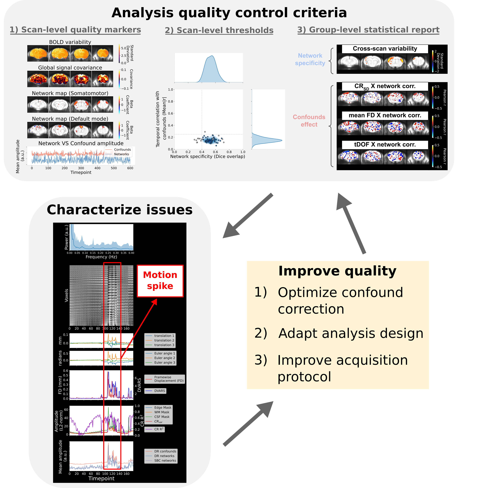

# Data quality assessment

(analysis_QC_target)=

```{toctree}
---
maxdepth: 3
---
nested_docs/scan_diagnosis.md
nested_docs/distribution_plot.md
nested_docs/group_stats.md
nested_docs/optim_CR.md
```

Data quality can have serious impacts on analysis outcomes, leading to false findings. Rodent imaging can suffer from spurious effects on connectivity measures if potential confounds are not well accounted for, or acquisition factors, such as anesthesia levels, can influence network activity {cite}`Desrosiers-Gregoire2024-ou,Grandjean2020-fa`. To support interpretability, troubleshooting and reproducible research, RABIES includes a set of reports for conducting data quality assessment in individual scans and conducting quality control prior to network analysis at the group level. The reports are designed most specifically to evaluate the detectability of canonical brain networks and the impact of potential confounds (motion, physiological instabilities, and more). 

This page describes how to generate the reports, our guidelines for conducting quality network of network analysis, and how to include those reports in a publication.

## Generating the reports

At the analysis stage of the pipeline, the `--data_diagnosis` option can be selected to generate the data quality reports. To generate the report, ICA components must also be provided with `--prior_maps` and a set of components corresponding to confounds must be selected using `--conf_prior_idx` (see further details below). Connectivity can be evaluated for both dual regression and seed-based connectivity:
* **For [dual regression](DR_target)**: dual regression is always conducted using the set components from `--prior_maps`, since certain features are derived from confound components defined in `--conf_prior_idx`. On the other hand, connectivity will be evaluated in the reports for each network included in `--bold_prior_idx`.
* **For [seed-based connectivity](SBC_target)**: reports will be generated for each seed provided to `--seed_list`. However, each seed needs to be supplemented with a reference network map (a 3D Nifti file for each seed, provided with `--seed_prior_list`) which should represent the expected connectivity for the canonical network corresponding to that seed.
<br>
The set of reports are generated in the `data_diagnosis_datasink/` (details [here](diagnosis_datasink_target)). The interpretation of each report is described within its dedicated documentation page, and include:

* [Spatiotemporal diagnosis](diagnosis_target): this qualitative report generated for each scan regroups a set of temporal and spatial features allowing to characterize the specific origin of data quality issues.
* [Distribution plots](dist_plot_target): quantitative report displaying the distribution of scans along measures of: specificity of network connectivity, network amplitude (for dual regression), and confound measures. Visualizing the dataset distribution can help identify outliers.
* [Group statistics](group_stats_target): for a given network, this group-level report regroups brain maps for visualizing cross-scan variability in connectivity and the group-wise correlation between connectivity and confounds.

### Classification of group ICA components

Ideally, the ICA components should be derived directly from the dataset analyzed by using [group ICA](ICA_target), although a [pre-computed set](https://zenodo.org/record/5118030/files/melodic_IC.nii.gz) is available by default. Newly-generated components must be visually inspected to identify the set of components corresponding to confound sources (which is inputted with `--conf_prior_idx`). This can be done by visualizing the group_melodic.ica/melodic_IC.nii.gz file, or using the automatically-generated FSL report in group_melodic.ica/report. Similarly, components corresponding to networks of interest can be identified and inputted with `--bold_prior_idx`.

Classifying components requires careful considerations, and we recommend a conservative inclusion (i.e. not every components need to be classified, only include components which have clear feature delineating a network or a confound). Consult {cite}`Zerbi2015-nl` or {cite}`Desrosiers-Gregoire2024-ou` for more information on classifying ICA components in rodents, or the [pre-computed set](https://zenodo.org/record/5118030/files/melodic_IC.nii.gz) can be consulted as reference (the defaults for `--bold_prior_idx` and `--conf_prior_idx` correspond to the classification of these components). 

## Guidelines for analysis quality control



Below are our recommendations for how the set of quality reports can be used identify and control for the impact of data quality issues on downstream group analysis. Although the reports may be used for a breadth of applications, these guidelines are formulated most specifically for a standard resting-state fMRI design aiming to compare network connectivity between subjects or groups. In particular, the following guidelines aim to identify features of spurious or absent connectivity, remove scans where these features are prominent to avoid false results (e.g. connectivity difference is driven by motion), and determine whether these issues may confound group statistics.

1. Inspect the [spatiotemporal diagnosis](diagnosis_target) for each scan. Particular attention should be given to the 4 main quality markers defining [categories of scan quality](quality_marker_target), and whether features of spurious or absent connectivity are prominent.
2. If spurious or absent connectivity is prominent in a subset of scans, these scans should be detected and removed to mitigate false results. This is done by setting thresholds using `--scan_QC_thresholds` for scan-level measures of network specificity and confound correlation. These measures are documented in the [distribution plots](dist_plot_target), and the specific measures for each scan ID can be consulted in the CSV file accompanying the plot. Using this CSV file, sensible threshold values can be selected for delineating scans with spurious or absent connectivity. Additionally, for dual regression analysis, `--scan_QC_thresholds` can be used to automatically detect and remove scans which present outlier values in network amplitude, which can be an indicator of spurious connectivity {cite}`Nickerson2017-gq`. By applying `--scan_QC_thresholds`, these scans won't be included for generating the group statistical report (thus the reports must re-generated after defining `--scan_QC_thresholds`).
3. Finally, the [group statistical report](group_stats_target) can be consulted to identify the main driven of variability in connectivity across scans, and whether it relates primarily to network activity or to confounds.

If significant issues are found from this evaluation, the design of the confound correction stage may be revisited to improve quality outcomes (see [dedicated documentation](optim_CR)). 

**Disclaimer**: Although these guidelines are meant to support identifying analysis pitfalls and improve research transparency, they are not meant to be prescriptive. The judgement of the experimenter is paramount in the adopting adequate practices (e.g. network detectability may not always be expected, if studying the impact of anesthesia or inspecting a visual network in blind subjects), and the conversation surrounding what should constitute proper standards for resting-state fMRI is evolving.

### Reporting in a publication

All figures from the report are generated in PNG (or SVG) format, and can be shared along a publication for data transparency. Ideally, a version of the spatiotemporal diagnosis can be shared for each scan used in deriving connectivity results, together with a group statistical report and its affiliated distribution plot for each groups/datasets if the analysis involves comparing connectivity differences across subjects and/or group.
<br>
The set of ICA components classified as networks and confounds should be reported appropriately (e.g. melodic_IC.nii.gz file can be shared with its associated component classification). If certain scan inclusion/exclusion criteria were selected based on the quality control guidelines described above, it is particularly important to describe the observations motivating these criteria and make the associated reports readily accessible for consultation (e.g. the set of spatiotemporal diagnosis files for scans displaying spurious/absent connectivity and motivated setting a particular QC threshold with `--scan_QC_thresholds`). If the design of confound correction was defined using these tools, this should also be appropriately reported.

