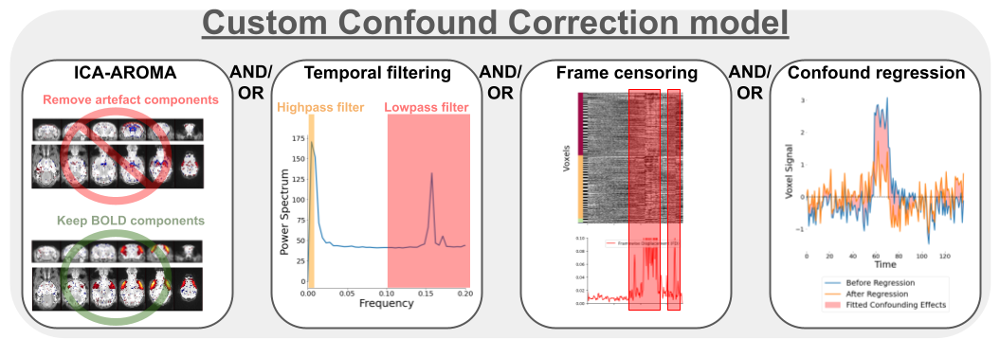

# Confound Correction pipeline

(confound_pipeline_target)=




The workflow for confound correction regroups a broad set of standard tools from the human litterature. The implementation of each step is structured to follow best practices and prevent re-introduction of confounds, as recommended in {cite}`Power2014-yf` and {cite}`Lindquist2019-lq`. Importantly, each operation is optional (except detrending), and a set of operations can be selected to design a customized workflow. Optimal correction strategy can be dataset-specific, and ideally, should be tuned to address relevant quality issues identified within the dataset (see section on [data quality assessment](analysis_QC_target)).

1. **Frame censoring** (`--frame_censoring`): Frame censoring temporal masks are derived from FD and/or DVARS thresholds, and applied first on both BOLD timeseries before any other correction step to exclude signal spikes which may bias downstream corrections, in particular, detrending, frequency filtering and confound regression{cite}`Power2014-yf`. 
    * Censoring with framewise displacement (see [definition](FD_target)): Apply frame censoring based on a framewise displacement threshold. The frames that exceed the given threshold, together with 1 back and 2 forward frames will be masked out{cite}`Power2012-ji`.
    * Censoring with DVARS (see [definition](DVARS_target)): The DVARS values are z-scored ($DVARS_Z = \frac{DVARS-\mu}{\sigma}$, where $\mu$ is the mean DVARS across time, and $\sigma$ the standard deviation), and frames with $|DVARS_Z|>2.5$ (i.e. above 2.5 standard deviations from the mean) are removed. Z-scoring and outlier detection is repeated within the remaining frames, iteratively, until no more outlier is detected, to obtained a final set of frames post-censoring.
    * `--match_number_timepoints` : This option can be selected to constrain each scan to retain the same final number of frames, to account for downstream impacts from unequal temporal degrees of freedom (tDOF) on analysis. To do so, a pre-set final number of frames is defined with `minimum_timepoint`, and a number of extra frames remaining post-censoring (taking into account edge removal in 5) ) is randomly selected and removed from the set.

2. **Detrending** (`--detrending_order`): Linear (or quadratic) trends are removed from timeseries. Detrended timeseries $\hat{Y}$ are obtained by performing ordinary-least square (OLS) linear regression, 
$$ 
\beta = OLS(X,Y) 
$$
$$ 
\hat{Y} = Y - X\beta 
$$
where Y is the timeseries and the predictors are $X = [intercept, time, time^2]$ ($time^2$ is included if removing quadratic trends).

3. **ICA-AROMA** (`--ica_aroma`): Cleaning of motion-related sources using the ICA-AROMA{cite}`Pruim2015-nm` classifier. The hard-coded human priors for anatomical masking and the linear coefficients for classification were adapted from the [original code](https://github.com/maartenmennes/ICA-AROMA) to function with rodent images. ICA-AROMA is applied prior to frequency filtering to remove further effects of motion than can result in ringing after filtering{cite}`Carp2013-uf,Pruim2015-nm`. 

4. **Frequency filtering** (`--TR`/`--highpass`/`--lowpass`/`--edge_cutoff`):
    1. Simulating censored timepoints: frequency filtering requires particular considerations when applied after frame censoring, since conventional filters cannot handle missing data (censoring results in missing timepoints). To address this issue, we implemented a method described in {cite}`Power2014-yf` allowing the simulation of data points while preserving the frequency composition of the data. This method relies on an adaptation of the Lomb-Scargle periodogram, which allows estimating the frequency composition of the timeseries despite missing data points, and from that estimation, missing timepoints can be simulated while preserving the frequency profile {cite}`Mathias2004-rt`.
    2. Butterworth filter: Following the simulation, frequency filtering (highpass and/or lowpass) is applied using a 3rd-order Butterworth filter ([scipy.signal.butter](https://docs.scipy.org/doc/scipy/reference/generated/scipy.signal.butter.html)). If applying highpass, it is recommended to remove 30 seconds at each end of the timeseries using `--edge_cutoff` to account for edge artefacts following filtering{cite}`Power2014-yf`. After frequency filtering, the temporal mask from censoring is re-applied to remove simulated timepoints.

(CR_target)=
5. **Confound regression** (`--conf_list`): For each voxel timeseries, a selected set of nuissance regressors (see [regressor options](regressor_target)) are modelled using OLS linear regression and their modelled contribution to the signal is removed. Regressed timeseries $\hat{Y}$ are obtained with 
$$\beta = OLS(X,Y)$$
$$ Y_{CR} = X\beta $$ 
$$ \hat{Y} = Y - Y_{CR} $$ 
where $Y$ is the timeseries, $X$ is the set of nuisance timecourses and $Y_{CR}$ is the confound timeseries predicted from the model at each voxel ($Y_{CR}$ is a time by voxel 2D matrix).

6. **Intensity scaling** (`--image_scaling`): Voxel intensity values should be scaled to improve comparability between scans/datasets. The following options are provided:
    * Grand mean (**recommended**): Timeseries are divided by the mean intensity across the brain, and then multiplied by 100 to obtain percent BOLD deviations from the mean. The mean intensity of each voxel is derived from the $\beta$ coefficient from the intercept computed during **Detrending**.
    * Voxelwise mean: Same as grand mean, but each voxel is independently scaled by its own mean signal.
    * Global standard deviation: Timeseries are divided by the total standard deviation across all voxel timeseries.
    * Voxelwise standardization: Each voxel is divided by its standard deviation.
    * Homogenize variance voxelwise: if no scaling was already applied voxelwise (voxelwise mean or standardization), by selecting the option `--scale_variance_voxelwise`, timeseries are first scaled voxelwise by their standard deviation (yielding homogeneous variance distribution across voxels), and then re-scaled to preserve the original total standard deviation of the entire 4D timeseries (i.e. the global standard deviation does not change). Inhomogeneous variability distribution can be a [confound signature](quality_marker_target), thus this option may downscale their impact. `--scale_variance_voxelwise` can be applied in combination with grand mean scaling.

7. **Smoothing** (`--smoothing_filter`): Timeseries are spatially smoothed using a Gaussian smoothing filter ([nilearn.image.smooth_img](https://nilearn.github.io/dev/modules/generated/nilearn.image.smooth_img.html)). 


## rabies.confound_correction_pkg.confound_correction.init_confound_correction_wf [[source code](https://github.com/CoBrALab/RABIES/blob/master/rabies/confound_correction_pkg/confound_correction.py)]

```{literalinclude} ../rabies/confound_correction_pkg/confound_correction.py
:start-after: confound_wf_head_start
:end-before: confound_wf_head_end
```