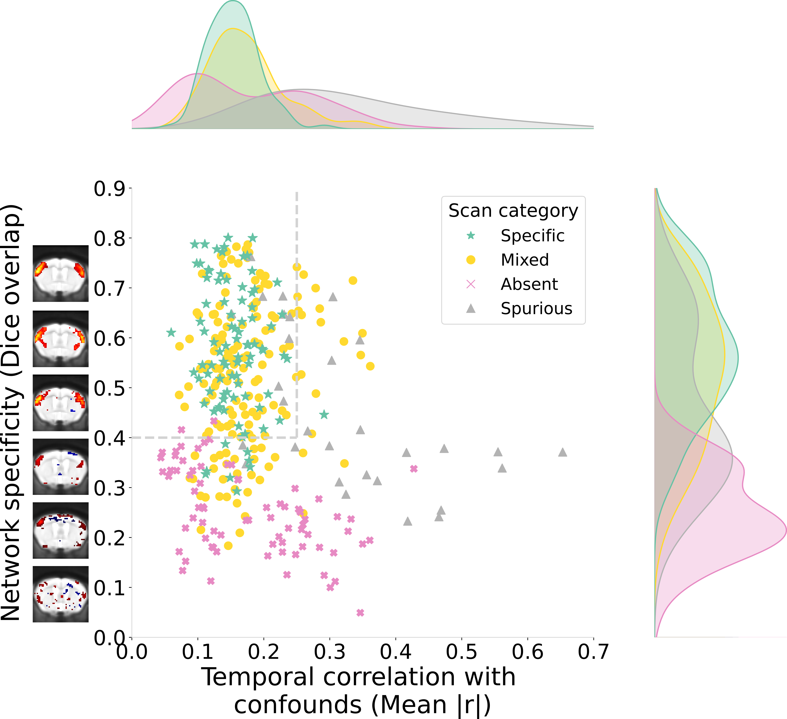

# Distribution plot

(dist_plot_target)=

The distribution plot allows visualizing the distribution of data quality measures across the dataset, where measures of network connectivity (specificity and amplitude) are contrasted with measures of confounds across samples (each point in the plot is a scan). Data points labelled in gray were removed using `--scan_QC_thresholds`, where the gray dotted lines correspond to the QC thresholds selected for network specificity (Dice overlap) and DR confound correlation. Among the remaining samples and for each metric separately, scan presenting outlier values were detected based on a modified Z-score threshold (set with `--outlier_threshold`, 3.5 by default) and labelled in orange. The derivation of the quality metrics is described in details on the [metrics documentation](dist_plot_metrics).
 

The report was designed to subserve two main functions: 1. Inspect that network specificity is sufficient and the temporal correlation with confounds (i.e. DR confound corr.) minimal, and set thresholds for scan inclusion using `--scan_QC_thresholds` (top right subplot, more details on this below), and 2. complement the group statistical report to visualize the association between connectivity and the three confound measures included in the report ($CR_{SD}$, mean FD and tDOF). In the later case, it can be possible for instance to determine whether a group-wise correlation in statistical report is driven by outliers.

## Scan-level thresholds based on network specificity and confound temporal correlation

The measures of network specificity (using Dice overlap) and temporal correlation with confounds (where confound timecourses are extracted using confound components specified with `--conf_prior_idx` and measured through dual regression) were defined in {cite}`Desrosiers-Gregoire2024-ou` for conducting scan-level QC (the figure above is reproduced from the study). They were selected as ideal measures for quantifying issues of network detectability and spurious connectivity (the figure above demonstrate how [categories of scan quality outcomes](quality_marker_target) can be distinguished with these metrics), and applying inclusion thresholds to select scans which respect assumptions for network detectability and minimal effects from confounds.
