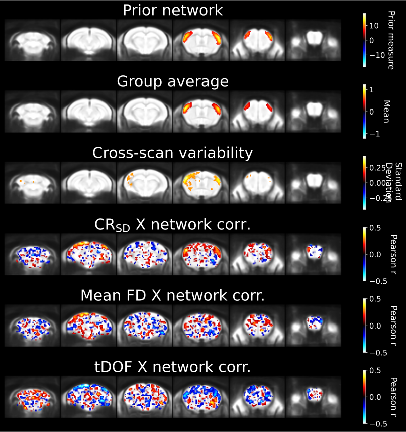

# Group stats

(group_stats_target)=

Inspecting scan-level features is insufficient to conclude that inter-scan variability in connectivity isn't itself impacted (which is of primary interest for group analysis). This final report is aimed at inspecting features of connectivity variability at the group level, and focuses on two aspects: 

1. **Specificity of network variability:** the standard deviation in connectivity across scan is computed voxelwise. This allows to visualize the spatial contrast of network variability. If primarily driven by network connectivity, the contrast should reflect the anatomical extent of the network of interest (as in the example above for the mouse somatomotor network), or otherwise may display spurious or absent features. For more details on the development of this metric, consult {cite}`Desrosiers-Gregoire2024-ou`.
    - **Relationship to sample size**: {cite}`Desrosiers-Gregoire2024-ou` demonstrate that the contrast of the network variability map depends on sample size. If network connectivity is observed in individual scans, but not in this statistical report, increasing sample size may improve this contrast.
2. **Correlation with confounds:** Connectivity is correlated across subject, for each voxel, with either of the three measures of confound included: variance explained from confound correction at a given voxel ($CR_{SD}$, see [predicted confound timeseries $Y_{CR}$](CR_target)), mean framewise displacement (FD), or temporal degrees of freedom. This allows establishing the importance of the association with potential confounds. What constitute a 'concerning' correlation may depend on the study, and the effect size of interest (i.e. is the effect size of interest much higher or similar to the effect size of confounds?). 

**Quantitative CSV report**: A CSV file is also automatically generated along the figure, which records a quantitative assessment of these two aspects. More specifically, the overlap between the network variability map and the reference network map is measuring using Dice overlap, and for confound measures, the mean correlation is measured within the area of the network (consult the [metric details elsewhere](group_QC_metrics)). These measures can be referred to for a quantitative summary instead (although visualization is preferred, as the Dice overlap for network variability may not perfectly distinguish network and spurious features).

**IMPORTANT**: the validity of this report is dependent on whether [scan-level assumptions](dist_plot_target) of network detectability and minimal confound effects are met. This is because either the lack of network activity or spurious effects in a subset of scan can drive 'apparent' network variability, since there will be differences in the presence VS absence of the network across scans, but these differences may be actually driven by data quality divergences.