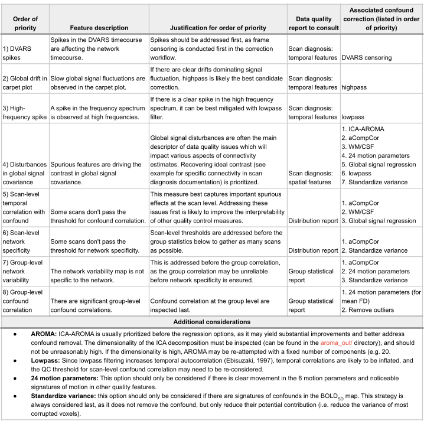

# Optimization of confound correction strategy

(optim_CR)=

On this page is a procedure for improving confound correction design based on observations from the data quality assessment reports. These recommendations were originally developed in {cite}`Desrosiers-Gregoire2024-ou`, and consist of a stepwise protocol where confound correction is improved incrementally while referring to data quality reports and the table found on this page, relating data quality features to corresponding corrections. The protocol is as follows:

1. Initiate a **minimal** confound correction, and generate data quality reports at the analysis stage. Correction should be minimal at first to mitigate potential issues of over-correction, where network activity itself can be removed by excessive correction. A minimal correction can consist of applying frame censoring using framewise displacement and the regression of 6 motion parameters together with spatial smoothing. 
2. Evaluation of the data quality reports (as described in the [guidelines on the main page](analysis_QC_target))
3. The most sensible additional correction is selected based on the observations and using the table below. 
4. The confound correction pipeline stage is re-run with **one** additional correction at a time, and the data quality reports are re-evaluated. Only a single correction is tested at a time so its impact can be evaluated, and the correction is only kept if there were beneficial impacts.
5. Repeat 3. and 4. until desirable quality outcomes are met, or no further options are left for confound correction.

The table below offers guidance for prioritizing additional corrections based on observations from the data quality reports. The confound correction workflow and the various strategies available are described elsewhere in the [confound correction pipeline](confound_pipeline_target).

