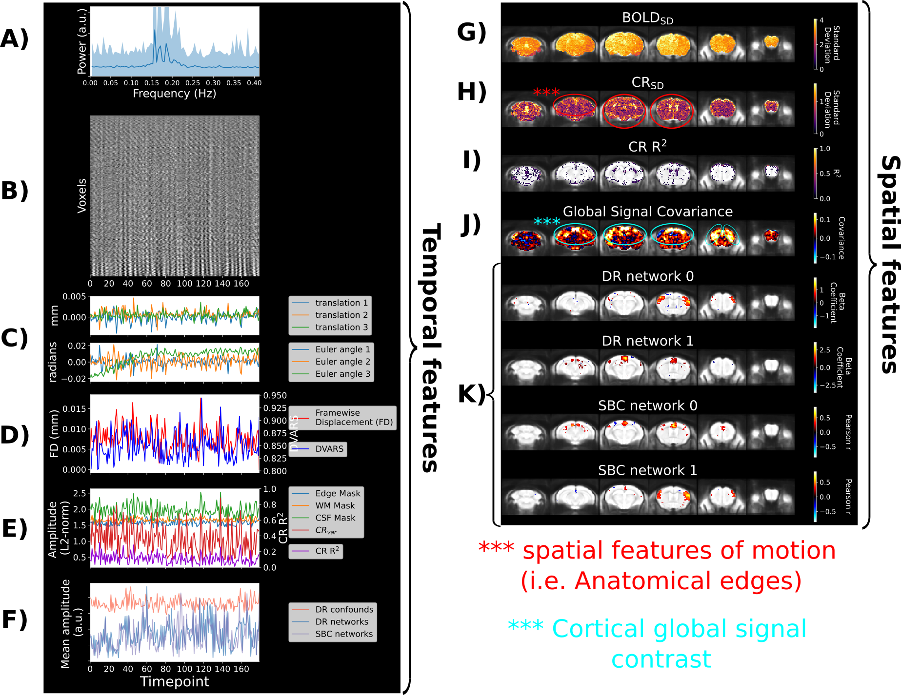
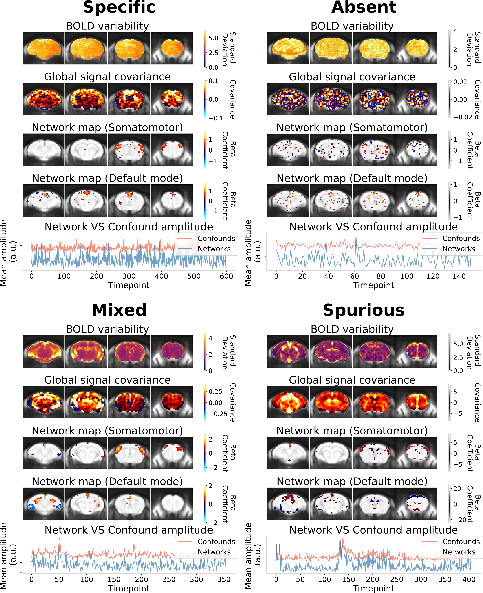

# Scan diagnosis report
(diagnosis_target)=

By executing `--data_diagnosis` at the analysis stage of the pipeline, a set of visual reports are generated to support data quality assessment in relationship to connectivity analysis. Here, the *spatiotemporal diagnosis* report is described. The diagnosis is a visual report generated for each scan independently after conducting dual regression or seed-based connectivity analysis. It will display a large set of temporal and spatial features for the scan supporting the assessment of potential data quality issues, and whether network connectivity is impacted. Unless specified otherwise, all metrics are computed from fMRI timeseries after the confound correction stage. This page first covers an example of the report with the description for the set of features, and second provides guidance for interpreting the report.

## Spatiotemporal diagnosis

Above is an example of the report (files generated into the `data_diagnosis_datasink/figure_temporal_diagnosis/` and `data_diagnosis_datasink/figure_spatial_diagnosis/` folders) for a scan with little confound signatures and clear network connectivity. Each spatial map is represented along 6 cortical slices, overlapped onto the anatomical template in common space. The network maps from dual regression (DR) or seed-based connectivity (SBC) are thresholded to include the top 4% of the voxels with the highest values. In this example, both dual regression and seed-based connectivity was conducted, where DR network 0 and SBC network 1 correspond to analysis of the somatomotor network, whereas DR network 1 and SBC network 0 correspond to the default mode network. Below we detail the interpretation of each feature included in the diagnosis (whereas the detailed computations for each metric are further described in the [Metric definitions](metrics_target) page):

* **A) Power spectrum:** the frequency power spectrum (averaged across voxels) is displayed to assess the dominant frequency profile.

* **B) Carpet plot:** the entire fMRI timeseries are displayed in a time by voxel 2D matrix. This allows to visualize global fluctuations in signal intensity, which can be a proxy for various global artefacts {cite}`Power2017-wn`.

* **C) The translation and rotation head motion parameters:** those are the 6 rigid body parameters estimated during preprocessing, and allow tracking of head position across scan duration.

* **D) The framewise displacement and the temporal shifts in global signal from the root-mean-square of the timeseries’ temporal derivative (DVARS) {cite}`Power2012-ji`:** Framewise displacement quantifies movement between consecutive frames, which reveals the timing and amplitude of spontaneous motion, whereas DVARS reveals shifts in global fMRI signal intensities (which can also indicate suspicious spikes in signal).

* **E) Markers of confounded fMRI signal fluctuation with anatomical masks and confound regression:** A representative timecourse is derived within a set of anatomical masks (edge, white matter and CSF masks) using the L2-norm across voxels. Each of these anatomical regions is susceptible to motion {cite}`Pruim2015-nm`, and the white matter and CSF signal can reveal physiological confounds, thus offering broader insights into potential confound sources. Furthermore, the diagnosis leverages the confound regression step, where nuisance timecourses (e.g. the 6 realignment parameters) are fitted against the fMRI signal at each voxel to obtain a modelled timecourse representing the confounded portion of the fMRI signal. To obtain an average confound timecourse across the brain, we compute the L2-norm across voxels. The proportion of variance explained by confound regression is also provided. These features allow both to visualize confound effects, and evaluate whether confound regression appropriately modelled confounds detected from other temporal features.

* **F) Mean amplitude of network VS confound timecourses:** The averaged timecourse between network analyses and confound sources are compared to assess whether network amplitude is spurious (i.e. correlated with confound timecourse). To model confound timecourses, dual regression analysis is conducted with a complete set of components from Independent Component Analysis representing a mixture of networks and confounds from various origins, and the timecourses from confound components are compiled to summarize a broad set of potential confounds (by default, RABIES [this set](https://zenodo.org/record/5118030/files/melodic_IC.nii.gz) of ICA components for mice).

* **G) Spatial distribution in signal variability (BOLDSD):** The first spatial feature of the diagnosis is the signal variability (standard deviation) at each voxel. This map offers an index of whether significant confounds are contributing to the signal (see other examples in **Interpretation of the report and main features to inspect**). Without the influence from confounds, as in this example, signal variability is largely homogeneous. 

* **H) Confound regression variance explained (CRSD):** The variance explained from confound regression is quantified at each voxel by taking the standard deviation from the modelled confound timecourse. This allows to contrast spatially the amplitude of confound effects. This feature can specifically delineate the presence of confounds and identify the type of confound. In this example, minor motion signatures are identified.

* **I) Confound regression variance explained proportion:** Similar to CRSD, but showing instead the proportion of variance explained (R2).

* **J) Global signal covariance:** This map displays the covariance of each voxel with the global signal. The contrast from this map allows to evaluate the predominant source of global signal fluctuation, which can take various forms depending on the contributions from neural network and confounds (see examples below in **Interpretation of the report and main features to inspect**). In the ideal case, there is predominant contrast found in gray matter, with a shape reminescent of brain network, as in the example shown above.

* **K) Network spatial maps:** Finally, the diagnosis shows the spatial network maps fitted using dual regression (or seed-based analysis) from the selected set of brain networks of interest (in this case the somatomotor and default mode networks). These fits provide insights into the quality of network analysis, and how they may affect downstream statistical analyses.

* Note that if frame censoring was applied, the time axis is discontinued (i.e. there are holes that are not shown.)
* Note that $CR_{SD}$ and $CR_{R^2}$ are computing according to the specified list of regressors `--conf_list` during confound correction. If no regressor was specified, $CR_{SD}$ and $CR_{R^2}$ are still estimated with a regression of the 6 motion parameters, but the regression isn't applied to remove signal from the timeseries.

## Interpretation of the report and main features to inspect
(quality_marker_target)=

A subset of the features in the spatiotemporal diagnosis are most crucial in determining scan quality in relationship to connectivity analysis, and are displayed above across 4 main categories of scan quality. Below we describe the key role of these four features in relationship to those 4 scan categories:

* **BOLD variability:** The resulting BOLD variability map presents an homogeneous contrast in uncorrupted scans, and can otherwise reveal the anatomical signature of confounds, thus allowing to identify the type of confound.

* **Global signal covariance:** The global signal covariance map is sensitive to both non-neural confounds (e.g. the spurious category) and network signatures (e.g. the specific category). The global signal covariance thus reflects whether network or confound sources dominate coordinated fluctuations, and can delineate the most likely contributors to downstream connectivity measures.

* **Network map:** Allows inspecting whether the expected anatomical features of the network are effectively captured (i.e. network specificity). This is most crucial in ensuring that the network is not absent (see the absent category), or to ensure that the network shape is not distorded with spurious features (see spurious category).

* **Network and confound timecourses:** Finally, the respective timecourses for networks and confounds can be compared to reveal direct relationships between network amplitude and confounds in the temporal domain. Although this metric does not describe the type of confound, it is the most direct indicator of spurious connectivity. It is an important complement to the inspection of network shape, since spurious effects may only affect amplitude with minimal impact on shape.

These 4 features are sufficient to capture the essential characteristics of network detectability and spurious connectivity at the single scan level. The remaining features from the spatiotemporal diagnosis provide additional details regarding timeseries properties, the motion parameters, or confound regression, and can further support characterizing the specific origin of confounds (e.g. determining that a correlation between network and confound timecourse is originating from framewise displacement (i.e. motion)).
