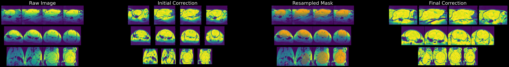
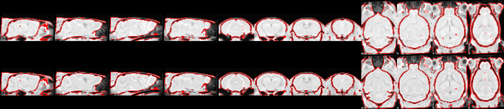
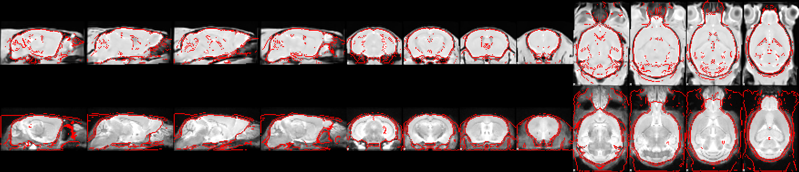
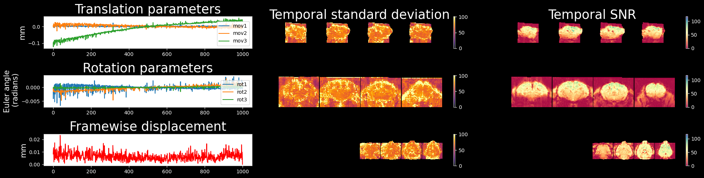

# Preprocessing quality control (QC)

Several registration operations during preprocessing are prone to fail in accurately aligning images, and it is thus necessary to visually inspect the quality of registration to prevent errors arising from failed alignment, or biased analyses downstream. For this purpose, RABIES generates automatically a set PNG images allowing for efficient visual assessment of key registration steps. These are found in the `{output_folder}/preprocess_QC_report/` folder, which contains several subfolders belonging to different registration step in the pipeline or providing supportive information about the files:

- `anat_inho_cor/`: intensity inhomogeneities are corrected for prior to important registration operations. This folder allows to assess the quality of the inhomogeneity correction, which is crucial for the performance of downstream registration. The figure is divided in 4 columns, showing 1-the raw image, 2-an initial correction of the image, 3-an overlay of the anatomical mask used to conduct a final correction (by default obtained through a preliminary registration to the commonspace template), and 4-final corrected output.

- `Native2Unbiased/`: alignment between each anatomical image and the generated unbiased template. This registration step controls for the overlap between different scanning sessions.

- `Unbiased2Atlas/`: alignment of the generated unbiased template to the external anatomical template in commonspace. This step ensures proper alignment with the commonspace and the associated brain parcellation.

- `bold_inho_cor/`: same as `anat_inho_cor/`, but conducted on the 3D reference EPI image which is used for estimating the alignment of the EPI.

- `EPI2Anat/`: shows the alignment of the EPI image to its associated anatomical image of the same scanning session. This step resamples the EPI into native space, and corrects for susceptibility distortions through non-linear registration. An example is shown below:

- `template_files/`: displays the overlap of the provided external anatomical template with it's associated masks and labels. Allows to validate that proper template files were provided and share those along the RABIES report.

- `temporal_features/`: includes the timecourse of the head motion realignment parameters together with framewise displacement, to observe subject motion. Also includes a spatial map of the signal variability at each voxel and then the temporal signal-to-noise ratio (tSNR).



```{toctree}
---
maxdepth: 3
---
nested_docs/registration_troubleshoot.md
