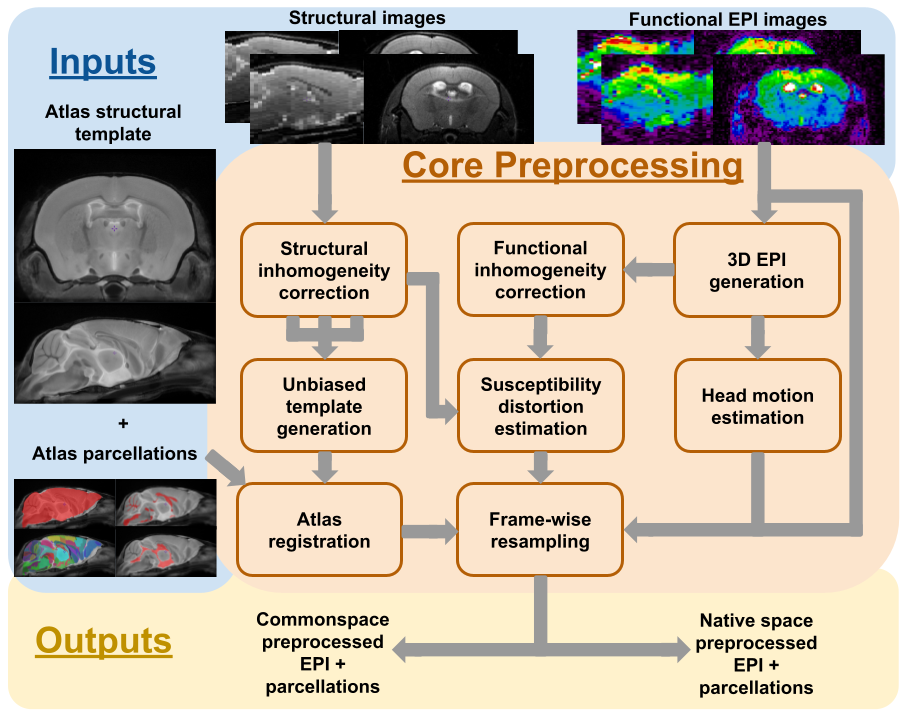
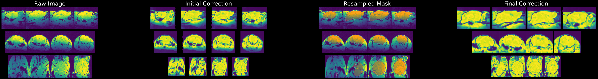
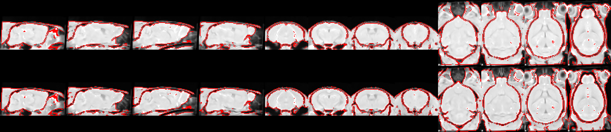
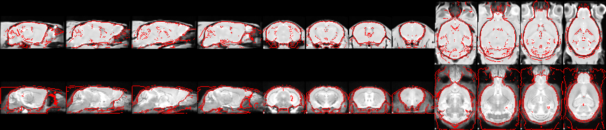
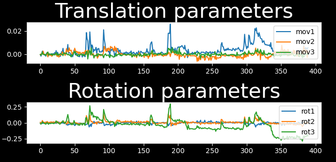
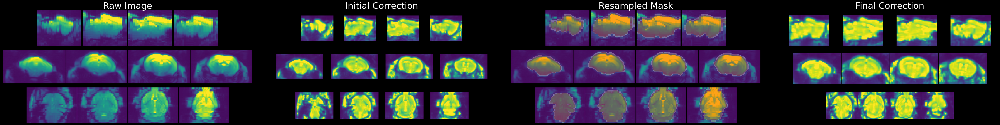
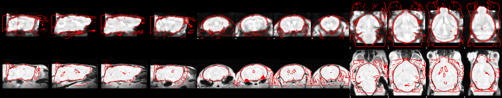

# Preprocessing Pipeline


The preprocessing of fMRI scans prior to analysis consists of, at minimum, the anatomical alignment of scans to a common space, head realignment to correct for motion, and the correction of susceptibility distortions arising from the echo-planar imaging (EPI) acquisition of functional scans. The core preprocessing pipeline in RABIES carries each of these steps with state-of-the-art processing tools and techniques.

To conduct common space alignment, structural images, which were acquired along the EPI scans, are initially corrected for inhomogeneities (**Structural inhomogeneity correction**) and then registered together to allow the alignment of different MRI acquisitions. This registration is conducted by generating an unbiased data-driven template (**Unbiased template generation**) through the iterative non-linear registration of each image to the dataset consensus average, where the average gets updated at each iteration to provide an increasingly representative dataset template (<https://github.com/CoBrALab/optimized_antsMultivariateTemplateConstruction>; {cite}`Avants2011-av`). The finalized template after the last iteration provides a representative alignment of each MRI session to a template that shares the acquisition properties of the dataset (e.g. brain shape, FOV, anatomical contrast, ...), making it a stable registration target for cross-subject alignment. This newly-generated unbiased template is then itself registered to an external reference atlas to provide both an anatomical segmentation and a common space comparable across studies defined from the provided reference atlas (**Atlas registration**).

The remaining preprocessing involves the EPI image. A volumetric EPI image is first derived using a trimmed mean across the EPI frames, after an initial motion realignment step (**3D EPI generation**). Using this volumetric EPI as a target, the head motion parameters are estimated by realigning each EPI frame to the target using a rigid registration (**Head motion estimation**). To correct for EPI susceptibility distortions, the volumetric EPI is first subjected to an inhomogeneity correction step (**Functional inhomogeneity correction**), and then registered non-linearly to the anatomical scan from the same MRI session, which allows to calculate the required geometrical transforms for recovering brain anatomy {cite}`Wang2017-ci` (**Susceptibility distortion estimation**). Finally, after calculating the transformations required to correct for head motion and susceptibility distortions, both transforms are concatenated into a single resampling operation (avoiding multiple resampling) which is applied at each EPI frame, generating the preprocessed EPI timeseries in native space {cite}`Esteban2019-rs` (**Frame-wise resampling**). Preprocessed timeseries in common space are also generated by further concatenating the transforms allowing resampling to the reference atlas.

The workflow of the RABIES preprocessing pipeline is summarized in the diagram above, and each preprocessing module is further described below.

## Structural inhomogeneity correction

**Figure:** displays steps of inhomogeneity correction for the structural image.

### rabies.preprocess_pkg.inho_correction.init_inho_correction_wf [[source code](https://github.com/CoBrALab/RABIES/blob/master/rabies/preprocess_pkg/inho_correction.py)]

```{literalinclude} ../rabies/preprocess_pkg/inho_correction.py
:start-after: inho_correction_head_start
:end-before: inho_correction_head_end
```

## Common space alignment (i.e. Unbiased template generation + Atlas registration)

**Figure:** displays the overlap between a structural scan (top) and the dataset-generated unbiased template (bottom).

**Figure:** displays the overlap between the unbiased template (top) and the reference atlas template (bottom).

### rabies.preprocess_pkg.commonspace_reg.init_commonspace_reg_wf [[source code](https://github.com/CoBrALab/RABIES/blob/master/rabies/preprocess_pkg/commonspace_reg.py)]
```{literalinclude} ../rabies/preprocess_pkg/commonspace_reg.py
:start-after: commonspace_wf_head_start
:end-before: commonspace_wf_head_end
```

(3D_EPI_target)=
## 3D EPI generation
### rabies.preprocess_pkg.bold_ref.init_bold_reference_wf [[source code](https://github.com/CoBrALab/RABIES/blob/master/rabies/preprocess_pkg/bold_ref.py)]

```{literalinclude} ../rabies/preprocess_pkg/bold_ref.py
:start-after: gen_bold_ref_head_start
:end-before: gen_bold_ref_head_end
```

## Head motion estimation

**Figure:** example of the 6 motion parameters.

### rabies.preprocess_pkg.hmc.init_bold_hmc_wf [[source code](https://github.com/CoBrALab/RABIES/blob/master/rabies/preprocess_pkg/hmc.py)]

```{literalinclude} ../rabies/preprocess_pkg/hmc.py
:start-after: hmc_wf_head_start
:end-before: hmc_wf_head_end
```

### rabies.preprocess_pkg.hmc.EstimateMotionParams [[source code](https://github.com/CoBrALab/RABIES/blob/master/rabies/preprocess_pkg/hmc.py)]

```{literalinclude} ../rabies/preprocess_pkg/hmc.py
:start-after: motion_param_head_start
:end-before: motion_param_head_end
```

## Functional inhomogeneity correction

**Figure:** displays steps of inhomogeneity correction for the volumetric EPI.

The workflow is the same as the **structural inhomogeneity correction**.

## Susceptibility distortion estimation

**Figure:** displays the overlap between the volumetric EPI (top) and structural image (bottom).

### rabies.preprocess_pkg.registration.init_cross_modal_reg_wf [[source code](https://github.com/CoBrALab/RABIES/blob/master/rabies/preprocess_pkg/registration.py)]

```{literalinclude} ../rabies/preprocess_pkg/registration.py
:start-after: cross_modal_reg_head_start
:end-before: cross_modal_reg_head_end
```

## Frame-wise resampling

### rabies.preprocess_pkg.resampling.init_bold_preproc_trans_wf [[source code](https://github.com/CoBrALab/RABIES/blob/master/rabies/preprocess_pkg/resampling.py)]

```{literalinclude} ../rabies/preprocess_pkg/resampling.py
:start-after: resampling_head_start
:end-before: resampling_head_end
```

## Adapted workflow without structural scans (i.e. --bold_only)
Structural scans are recommended, but not required to complete preprocessing with RABIES. An alternative workflow is also implemented to preprocess a input dataset which contains only EPI functional images, and can be selected with the `--bold_only` option. In this alternative workflow, the volumetric EPI corrected for inhomogeneity during **Functional inhomogeneity correction** replaces the structural image for the purpose of common space alignment, and is thus used for generating the unbiased template, in turn, this template is registered to the reference atlas. This final registration to the atlas accounts for estimation of susceptibility distortions instead of the registration to a structural image from the same MRI session. Given that this atlas registration must be applied to account for susceptibility distortions, only preprocessed timeseries in common space are provided when running this workflow. 
If using the RABIES default mouse atlas, the default template is changed to a EPI reference template, which offers a more robust target for EPI registration than a structural image as reference template.
