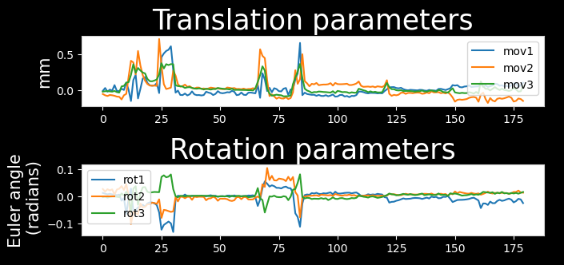

# Preprocessing Pipeline


The preprocessing of fMRI scans prior to analysis consists of, at minimum, the anatomical alignment of scans to a commmon space, head realignment to correct for motion, and the correction of susceptibility distortions arising from the echo-planar imaging (EPI) acquisition of functional scans. The core preprocessing pipeline in RABIES carries each of these step with state-of-the-art processing tools and techniques. 

To conduct **common space alignment**, structural images, which were acquired along the EPI scans, are initially corrected for inhomogeneities to allow the alignment of different MRI acquisitions. This is conducted by generating an unbiased data-driven template through the iterative non-linear registration of each image to the dataset consensus average, where the average gets updated at each iteration to provide an increasingly representative dataset template (https://github.com/CoBrALab/optimized_antsMultivariateTemplateConstruction; Avants et al., 2011). The finalized template after the last iteration will provide a representative alignment of each MRI session to a template that shares the acquisition properties of the dataset (e.g. brain shape, FOV, anatomical contrast, ...), which makes it a stable target for cross-subject alignment. After aligning the MRI sessions, this newly-generated unbiased template is then itself registered to an external reference atlas to provide an anatomical segmentation and a common space more directly comparable across studies, as defined from the provided reference atlas.

The remaining preprocessing involves the EPI image. A volumetric EPI image (3D EPI average) is first derived using a trimmed mean across the EPI frames, after an initial motion realignment step (see **3D EPI generation**). Using this 3D EPI average as a target, the **head motion parameters** are estimated by realigning each EPI frame to the target using a rigid registration. To correct for the **EPI susceptibility distortions**, the 3D EPI average is first subjected to an inhomogeneity correction step, and then registered non-linearly to the anatomical scan from the same MRI session, which allows to calculate the required geometrical transforms for recovering brain anatomy (Wang et al., 2017). Finally, after calculating the transformations required to correct for head motion and susceptibility distortions, both transforms are concatenated into a single resampling operation (avoiding multiple resampling) which is applied at each EPI frame, generating the preprocessed EPI timeseries in native space (Esteban et al., 2019). Preprocessed timeseries in common space are also generated by further concatenating the transforms allowing resampling to the reference atlas.

The workflow of the RABIES preprocessing pipeline is summarized in the diagram above, and each preprocessing module is further described below.

**References:**
- Avants, B. B., Tustison, N. J., Song, G., Cook, P. A., Klein, A., & Gee, J. C. (2011). A reproducible evaluation of ANTs similarity metric performance in brain image registration. NeuroImage, 54(3), 2033–2044.
- Esteban, O., Markiewicz, C. J., Blair, R. W., Moodie, C. A., Isik, A. I., Erramuzpe, A., Kent, J. D., Goncalves, M., DuPre, E., Snyder, M., Oya, H., Ghosh, S. S., Wright, J., Durnez, J., Poldrack, R. A., & Gorgolewski, K. J. (2019). fMRIPrep: a robust preprocessing pipeline for functional MRI. Nature Methods, 16(1), 111–116.
- Wang, S., Peterson, D. J., Gatenby, J. C., Li, W., Grabowski, T. J., & Madhyastha, T. M. (2017). Evaluation of Field Map and Nonlinear Registration Methods for Correction of Susceptibility Artifacts in Diffusion MRI. Frontiers in Neuroinformatics, 11, 17.

## Structural inhomogeneity correction

Workflow source code: https://github.com/CoBrALab/RABIES/blob/master/rabies/preprocess_pkg/inho_correction.py
```python
"""
Corrects an input 3D image for intensity inhomogeneities. The image is denoised with non-local mean 
denoising (Manjón et al., 2010) followed by iterative correction for intensity inhomogeneities (Sled 
et al., 1998). Initial masking is achieved via intensity thresholding, giving an initial correction of 
the image, and a registration is then conducted to register a brain mask for a final round of correction.

References:
    Manjón, J. V., Coupé, P., Martí-Bonmatí, L., Collins, D. L., & Robles, M. (2010). Adaptive non-local means 
        denoising of MR images with spatially varying noise levels. Journal of Magnetic Resonance Imaging: 
        JMRI, 31(1), 192–203.
    Sled, J. G., Zijdenbos, A. P., & Evans, A. C. (1998). A nonparametric method for automatic correction of 
        intensity nonuniformity in MRI data. IEEE Transactions on Medical Imaging, 17(1), 87–97.            

Command line interface parameters:
    --anat_inho_cor_method {Rigid,Affine,SyN,no_reg,N4_reg,disable}
                            Select a registration type for masking during inhomogeneity correction of the structural 
                            image. 
                            *** N4_reg: previous correction script prior to version 0.3.1.
                            *** disable: disables the inhomogeneity correction.
                            (default: SyN)
                            
    --bold_inho_cor_method {Rigid,Affine,SyN,no_reg,N4_reg,disable}
                            Select a registration type for masking during inhomogeneity correction of the EPI.
                            *** N4_reg: previous correction script prior to version 0.3.1.
                            *** disable: disables the inhomogeneity correction.
                            (default: Rigid)
                            
    --bold_inho_cor_otsu BOLD_INHO_COR_OTSU
                            The inhomogeneity correction script necessitates an initial correction with a Otsu
                            masking strategy (prior to registration of an anatomical mask). This option sets the 
                            Otsu threshold level to capture the right intensity distribution.
                            (default: 2)

Workflow:
    parameters
        opts: command line interface parameters
        image_type: between 'EPI' and 'structural'. Defines which script to run depending on 
            image type

    inputs
        target_img: the image to correct
        anat_ref: the registration target with a brain mask
        anat_mask: the brain mask of the registration target
        name_source: reference file for naming purpose

    outputs
        corrected: the output image after the final correction
        denoise_mask: the brain mask resampled on the corrected image
        init_denoise: the image after a first round of correction
"""
```

## Common space alignment (i.e. Unbiased template generation + Atlas registration)


Workflow source code: https://github.com/CoBrALab/RABIES/blob/master/rabies/preprocess_pkg/commonspace_reg.py
```python
"""
This workflow handles the alignment of all MRI sessions to a common space. This is conducted first by generating
a dataset-specific unbiased template from the input structural images, thereby aligning the different MRI 
sessions. Through a set of iterations, images are registered to a consensus average generated from the overlap 
of all scans at the previous iteration. Registrations are increasingly stringent, executing 2 iterations each 
for a rigid, then affine and finally non-linear template generation. The final iteration provides the individual 
transforms to align each scan to the unbiased template. This template generation process creates a robust target 
for the alignment of MRI sessions sharing the same acquisition properties, which will minimize registration 
inconsistencies between sessions, as opposed to the direct registration to an external template. The algorithm is 
implemented in https://github.com/CoBrALab/optimized_antsMultivariateTemplateConstruction.
After generating the unbiased template, the template itself is registered with a non-linear registration to the
reference atlas in common space, providing transforms to common space and the associated brain parcellations.


References:
    Avants, B. B., Tustison, N. J., Song, G., Cook, P. A., Klein, A., & Gee, J. C. (2011). A reproducible evaluation 
    of ANTs similarity metric performance in brain image registration. NeuroImage, 54(3), 2033–2044.

Command line interface parameters:
    Registration Options:
        Customize registration operations and troubleshoot registration failures.
        *** Rigid: conducts only rigid registration.
        *** Affine: conducts Rigid then Affine registration.
        *** SyN: conducts Rigid, Affine then non-linear registration.
        *** no_reg: skip registration.

    --atlas_reg_script {Rigid,Affine,SyN,no_reg}
                            Specify a registration script for alignment of the dataset-generated unbiased template 
                            to the commonspace atlas.
                            (default: SyN)
                            
    --commonspace_masking
                            Combine masks derived from the inhomogeneity correction step to support registration 
                            during the generation of the unbiased template, and then during atlas registration. 
                            (default: False)
                            
    --brain_extraction    If using --commonspace_masking and/or --coreg_masking, this option will conduct brain
                            extractions prior to registration based on the initial mask during inhomogeneity
                            correction. This will enhance brain edge-matching, but requires good quality masks.
                            (default: False)
                            
    --fast_commonspace    Skip the generation of a dataset-generated unbiased template, and instead, register each
                            anatomical scan independently directly onto the commonspace atlas, using the
                            --atlas_reg_script registration. This option can be faster, but may decrease the quality
                            of alignment between subjects.(default: False)

Workflow:
    parameters
        opts: command line interface parameters
        output_folder: specify a folder to execute the workflow and store important outputs
        transforms_datasink: datasink node where the transforms are stored
        num_procs: set the maximum number of parallel threads to launch

    inputs
        moving_image_list: list of files corresponding to the images from different MRI sessions
        moving_mask_list: mask files overlapping with the moving images, inherited from the inhomogeneity 
            correction step. These masks are used for --commonspace_masking and --brain_extraction
        atlas_anat: the structural template in common space
        atlas_mask: the brain mask in common space

    inputnode_iterable: this input node expects inputs from a upstream node which iterates over each MRI session,
        which allows to associate back the outputs from unbiased template generation to each MRI session
        iter_name: the file name from moving_image_list associated to a given MRI session

    outputs
        unbiased_template: the generated unbiased template
        native_mask: the atlas brain mask resampled to an associated MRI session in native space
        to_atlas_affine: affine transform for registration to the atlas
        to_atlas_warp: non-linear transform for registration to the atlas
        to_atlas_inverse_warp: inverse of the non-linear transform for registration to the atlas
        native_to_unbiased_affine: affine transform from native space to the unbiased template
        native_to_unbiased_warp: non-linear transform from native space to the unbiased template
        native_to_unbiased_inverse_warp: inverse of the non-linear transform from native space to the unbiased template
        native_to_commonspace_transform_list: ordered list of the transforms to apply to move from the
            native space to the common space
        native_to_commonspace_inverse_list: list defining whether the inverse of affine transforms should
            be applied for native_to_commonspace_transform_list
        commonspace_to_native_transform_list: ordered list of the transforms to apply to move from the
            common space to the natiev space
        commonspace_to_native_inverse_list: list defining whether the inverse of affine transforms should
            be applied for commonspace_to_native_transform_list
"""
```

## 3D EPI generation
Workflow source code: https://github.com/CoBrALab/RABIES/blob/master/rabies/preprocess_pkg/bold_ref.py
```python
"""
The 4D raw EPI file is used to generate a representative volumetric 3D EPI. This volume later becomes the target for 
motion realignment and the estimation of susceptibility distortions through registration to the structural image. 
Two iterations of motion realignment to an initial median of the volumes are conducted, then a trimmed mean is 
computed on the realignment volumes, ignoring 5% extreme, and this average becomes the reference image. The final
image is then corrected using non-local means denoising (Manjón et al., 2010).

References:
    Manjón, J. V., Coupé, P., Martí-Bonmatí, L., Collins, D. L., & Robles, M. (2010). Adaptive non-local means 
        denoising of MR images with spatially varying noise levels. Journal of Magnetic Resonance Imaging: 
        JMRI, 31(1), 192–203.

Command line interface parameters:
    --detect_dummy        Detect and remove initial dummy volumes from the EPI, and generate a reference EPI based on
                        these volumes if detected. Dummy volumes will be removed from the output preprocessed EPI.
                        (default: False)

Workflow:
    parameters
        opts: command line interface parameters

    inputs
        bold_file: Nifti file with EPI timeseries

    outputs
        ref_image: the reference EPI volume
        bold_file: the input EPI timeseries, but after removing dummy volumes if --detect_dummy is selected
"""
```

## Head motion estimation

Workflow source code: https://github.com/CoBrALab/RABIES/blob/master/rabies/preprocess_pkg/hmc.py 
```python
"""
This workflow estimates motion during fMRI acquisition. To do so, each EPI frame is registered to a volumetric 
target reference image with a rigid registration using ANTs' antsMotionCorr algorithm (Avants et al., 2009). 
The resulting 3 translation and 3 rotation realignment parameters are saved for all frames into an output CSV file.

References:
    Avants, B. B., Tustison, N., & Song, G. (2009). Advanced normalization tools (ANTS). The Insight Journal, 2, 1–35.

Command line interface parameters:
    --HMC_option {intraSubjectBOLD,0,1,2,3}
                            Select an option for head motion realignment among the pre-built options from
                            https://github.com/ANTsX/ANTsR/blob/master/R/ants_motion_estimation.R.
                            (default: intraSubjectBOLD)
                            
    --apply_slice_mc      Whether to apply a slice-specific motion correction after initial volumetric HMC. This can 
                            correct for interslice misalignment resulting from within-TR motion. With this option, 
                            motion corrections and the subsequent resampling from registration are applied sequentially
                            since the 2D slice registrations cannot be concatenate with 3D transforms. 
                            (default: False)

Workflow:
    parameters
        opts: command line interface parameters

    inputs
        bold_file: Nifti file with EPI timeseries to realign
        ref_image: the 3D image target for realignment

    outputs
        motcorr_params: CSV file which contains all translation and rotation parameters
        slice_corrected_bold: if using the experimental method --apply_slice_mc, these are the EPI frames 
            after both rigid and then slice-specific realignment
"""
```

## Functional inhomogeneity correction


The workflow is the same as the **structural inhomogeneity correction**.

## Susceptibility distortion estimation

Workflow source code: https://github.com/CoBrALab/RABIES/blob/master/rabies/preprocess_pkg/registration.py
```python
"""
The input volumetric EPI image is registered non-linearly to an associated structural MRI image.
The non-linear transform estimates the correction for EPI susceptibility distortions (Wang et al., 2017).

References:
    Wang, S., Peterson, D. J., Gatenby, J. C., Li, W., Grabowski, T. J., & Madhyastha, T. M. (2017). 
        Evaluation of Field Map and Nonlinear Registration Methods for Correction of Susceptibility Artifacts 
        in Diffusion MRI. Frontiers in Neuroinformatics, 11, 17.

Command line interface parameters:
    Registration Options:
        Customize registration operations and troubleshoot registration failures.
        *** Rigid: conducts only rigid registration.
        *** Affine: conducts Rigid then Affine registration.
        *** SyN: conducts Rigid, Affine then non-linear registration.
        *** no_reg: skip registration.

    --coreg_script {Rigid,Affine,SyN,no_reg}
                        Specify the registration script for cross-modal alignment between the EPI and structural
                        images. This operation is responsible for correcting EPI susceptibility distortions.
                        (default: SyN)
                                                    
    --coreg_masking       Use the mask from the EPI inhomogeneity correction step to support registration to the
                        structural image.
                        (default: False)
                        
    --brain_extraction    If using --commonspace_masking and/or --coreg_masking, this option will conduct brain
                        extractions prior to registration based on the initial mask during inhomogeneity
                        correction. This will enhance brain edge-matching, but requires good quality masks.
                        (default: False)

Workflow:
    parameters
        opts: command line interface parameters

    inputs
        ref_bold_brain: volumetric EPI image to register
        anat_ref: the target structural image
        anat_mask: the brain mask of the structural image
        moving_mask: a EPI mask inherited from inhomogeneity correction

    outputs
        bold_to_anat_affine: affine transform from the EPI to the anatomical image
        bold_to_anat_warp: non-linear transform from the EPI to the anatomical image
        bold_to_anat_inverse_warp: inverse non-linear transform from the EPI to the anatomical image
        output_warped_bold: the EPI image warped onto the structural image
"""
```

## Frame-wise resampling
Workflow source code: https://github.com/CoBrALab/RABIES/blob/master/rabies/preprocess_pkg/resampling.py
```python
"""
This workflow carries out the resampling of the original EPI timeseries into preprocessed timeseries.
This is accomplished by applying at each frame a combined transform which accounts for previously estimated 
motion correction and susceptibility distortion correction, together with the alignment to common space if
the outputs are desired in common space. All transforms are concatenated into a single resampling operation
to mitigate interpolation effects from repeated resampling.
This workflow also carries the resampling of brain masks and labels from the reference atlas onto the 
preprocessed EPI timeseries.

Command line interface parameters:
    Resampling Options:
        The following options allow to resample the voxel dimensions for the preprocessed EPIs
        or for the anatomical images during registration.
        The resampling syntax must be 'dim1xdim2xdim3' (in mm), follwing the RAS axis convention
        (dim1=Right-Left, dim2=Anterior-Posterior, dim3=Superior-Inferior). If 'inputs_defined'
        is provided instead of axis dimensions, the original dimensions are preserved.

    --nativespace_resampling NATIVESPACE_RESAMPLING
                        Can specify a resampling dimension for the nativespace fMRI outputs.
                        (default: inputs_defined)
                        
    --commonspace_resampling COMMONSPACE_RESAMPLING
                        Can specify a resampling dimension for the commonspace fMRI outputs.
                        (default: inputs_defined)

Workflow:
    parameters
        opts: command line interface parameters
        resampling_dim: specify the desired output voxel dimensions after resampling

    inputs
        name_source: a reference file for naming the output
        bold_file: the EPI timeseries to resample
        motcorr_params: the motion correction parameters
        transforms_list: a list of transforms to apply onto EPI timeseries, including 
            susceptibility distortion correction and resampling to common space
        inverses: a list specifying whether the inverse affine transforms should be 
            applied in transforms_list
        ref_file: a reference image in the targetted space for resampling. Should be the structural 
            image from the same session if outputs are in native space, or the atlas template for
            outputs in common space
        mask_transforms_list: the list of transforms to apply onto the atlas parcellations
            to overlap with the EPI
        mask_inverses: a list specifying whether the inverse affine transforms should be 
            applied in mask_transforms_list

    outputs
        bold: the preprocessed EPI timeseries
        bold_ref: a volumetric 3D EPI generated from the preprocessed timeseries
        brain_mask: the brain mask resampled onto preprocessed EPI timeseries
        WM_mask: the WM mask resampled onto preprocessed EPI timeseries
        CSF_mask: the CSF mask resampled onto preprocessed EPI timeseries
        vascular_mask: the vascular mask resampled onto preprocessed EPI timeseries
        labels: the atlas labels resampled onto preprocessed EPI timeseries
"""
```

## Adapted workflow without structural scans (i.e. --bold_only)
Structural scans are recommended, but not required to complete preprocessing with RABIES. An alternative workflow is also implemented to preprocess a input dataset which contains only EPI functional images, and can be selected with the `--bold_only` option. In this alternative workflow, the volumetric EPI corrected for inhomogeneity during **Functional inhomogeneity correction** replaces the structural image for the purpose of common space alignment, and is thus used for generating the unbiased template, in turn, this template is registered to the reference atlas. This final registration to the atlas accounts for estimation of susceptibility distortions instead of the registration to a structural image from the same MRI session. Given that this atlas registration must be applied to account for susceptibility distortions, only preprocessed timeseries in common space are provided when running this workflow. 
If using the RABIES default mouse atlas, the default template is changed to a EPI reference template, which offers a more robust target for EPI registration than a structural image as reference template.
